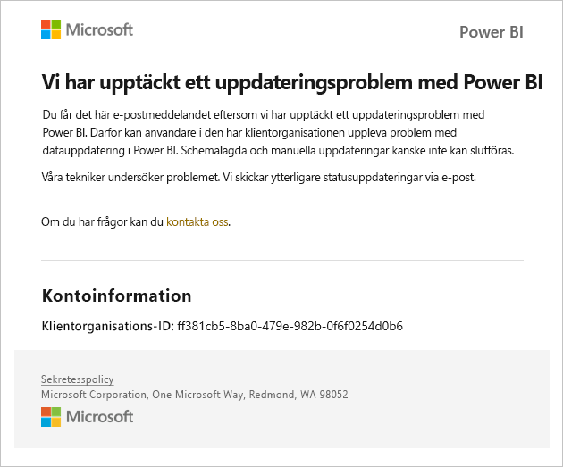
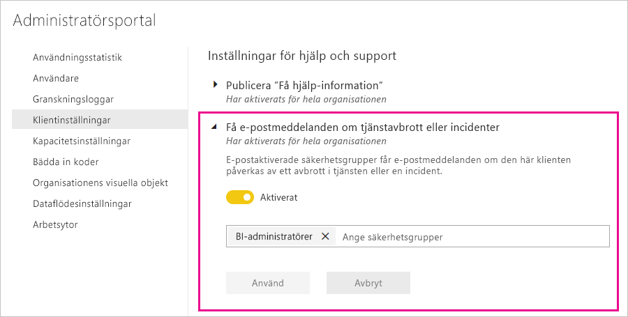

# Aviseringar om tjänstavbrott

Det är viktigt att få insyn i tillgängligheten för dina verksamhetskritiska affärs program. Power BI erbjuder incidentmeddelanden så att du kan välja att få e-post om det sker störningar eller försämring i tjänsten. Power BI-serviceavtalet på 99,9 % gör dessa händelser sällsynta, men vi vill ändå säkerställa att du informeras. Följande skärm bild visar den typ av e-post du får om du aktiverar meddelanden:

För tillfället skickar vi e-postmeddelanden för följande _tillförlitlighetsscenarier_:

- Tillförlitlighet för öppen rapport
- Tillförlitlighet för modelluppdatering
- Tillförlitlighet för frågeuppdatering

Meddelanden skickas när det uppstår _längre förseningar_ i åtgärder som att öppna rapporter, uppdatera datamängder eller köra frågor. När en incident har lösts får du ett uppföljningsmeddelande via e-post.

> [!NOTE]
> Den här funktionen är för närvarande endast tillgänglig för dedikerade kapaciteter i Power BI Premium. Den är inte tillgänglig för delad eller inbäddad kapacitet.

## Meddelanden om kapacitet och tillförlitlighet

När en Power BI Premium-kapacitet har långa perioder av hög resursanvändning som skulle kunna påverka tillförlitligheten, skickas en e-postavisering. Exempel på saker som kan påverka resursanvändningen är öppnande av rapporter, uppdateringar av datauppsättningar och frågekörningar. 

E-postmeddelandet innehåller information om orsaker till den höga resursanvändningen, till exempel:

* Datauppsättningens ID
* Åtgärdstyp
* CPU-tiden som är associerad med den höga resursanvändningen

Power BI skickar också e-postaviseringar när en överbelastning identifieras i en Power BI Premium-kapacitet. I e-postmeddelandet anges den troliga orsaken till överbelastningen, vilka åtgärder som genererat belastningen under de senaste 10 minuterna och hur stor belastning varje åtgärd har genererat. 

Om du har mer än en Premium-kapacitet innehåller e-postmeddelandet information om dessa kapaciteter under den överbelastade perioden, så du kan fundera över om du vill flytta de arbetsytor som innehåller resursintensiva objekt till de kapaciteter som har minst belastning.

E-postaviseringar om överbelastning skickas endast när ett tröskelvärde för överbelastning har nåtts. Du får inte ett till e-postmeddelande när belastningen på Premium-kapaciteten återgår till värden som ligger under gränsnivån för överbelastning.

Följande bild visar ett exempel på en e-postavisering:

## Aktivera meddelanden

En Power BI-klientorganisationsadministratör aktiverar meddelanden i administratörsportalen:

1. Identifiera eller skapa en e-postaktiverad säkerhetsgrupp som ska ta emot meddelanden.

1. I administratörsportalen väljer du **Klientorganisationsinställningar**. Under **Inställningar för hjälp och support** expanderar du **Få e-postmeddelanden om tjänstavbrott eller incidenter**.

1. Aktivera meddelanden, ange en säkerhetsgrupp och välj **Använd**.

    

> [!NOTE]
> Power BI skickar meddelanden från kontot no-reply-powerbi@microsoft.com. Se till att det här kontot har lagts till i listan över betrodda avsändare så att meddelanden inte hamnar i en skräppostmapp.

## Nästa steg

[Supportalternativ för Power BI Pro och Power BI Premium](service-support-options.md)

Har du fler frågor? [Prova Power BI Community](https://community.powerbi.com/)
