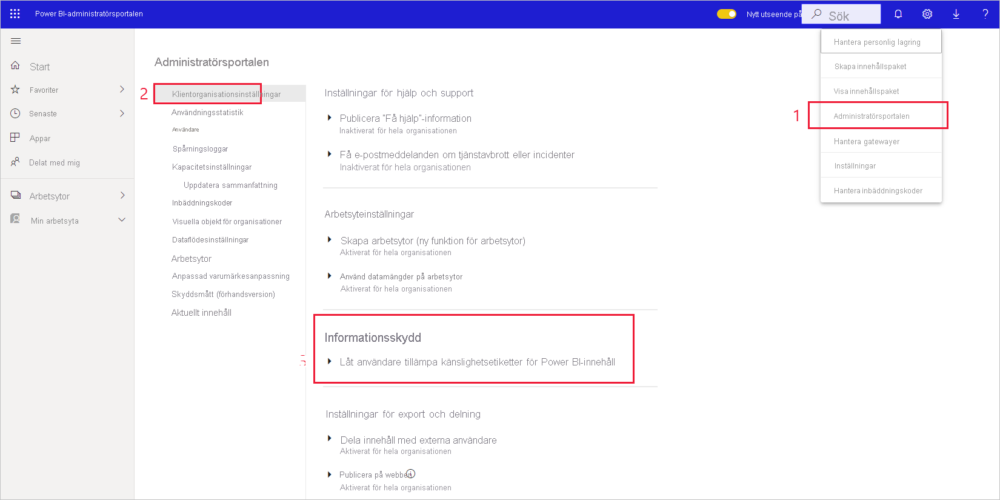

# Aktivera känslighetsetiketter i Power BI

[Känslighetsetiketter från Microsoft Information Protection](https://docs.microsoft.com/microsoft-365/compliance/sensitivity-labels) måste vara aktiverade i klientorganisationen för att kunna användas i Power BI. I den här artikeln kan Power BI-klientadministratörer se hur de gör detta. Om du vill få en översikt över känslighetsetiketterna i Power BI, kan du läsa [Känslighetsetiketter i Power BI](service-security-sensitivity-label-overview.md). Mer information om att tillämpa känslighetsetiketter i Power BI finns i [Tillämpa känslighetsetiketter](./service-security-apply-data-sensitivity-labels.md) 

När känslighetsetiketter är aktiverade:

* Angivna användare och säkerhetsgrupper i organisationen kan klassificera och [tillämpa känslighetsetiketter](./service-security-apply-data-sensitivity-labels.md) för sina rapporter, instrumentpaneler, datamängder och dataflöden i Power BI.
* Alla medlemmar i organisationen kan se de här etiketterna.

Om du ska aktivera känslighetsetiketter måste du ha en licens för Azure Information Protection. Mer information finns i [Licensiering](service-security-sensitivity-label-overview.md#licensing).

## Aktivera känslighetsetiketter

Gå till **administrationsportalen** för Power BI, öppna panelen **Klientinställningar** och letar reda på avsnittet **Informationsskydd**.

Utför följande steg i avsnittet **Information Protection**:
1. Öppna **Låt användare tillämpa känslighetsetiketter för Power BI-innehåll**.
1. Aktivera växlingsknappen.
1. Definiera vem som kan tillämpa och ändra känslighetsetiketter för Power BI-tillgångar. Som standard kan alla i organisationen tillämpa känslighetsetiketter. Du kan dock välja att endast låta vissa användare eller säkerhetsgrupper ställa in känslighetsetiketter. Om du väljer antingen hela organisationen eller specifika säkerhets grupper kan du undanta vissa delmängder av användare eller säkerhetsgrupper.
   
   * När känslighetsetiketter är aktiverade för hela organisationen är undantagen normalt säkerhetsgrupper.
   * När känslighetsetiketter bara är aktiverade för vissa användare eller säkerhetsgrupper så är undantagen normalt specifika användare.  
    Det här gör att du kan förhindra att vissa användare tillämpar känslighetsetiketter i Power BI, även om de tillhör en grupp som har behörighet att göra det.

1. Tryck på **Tillämpa**.

> [!IMPORTANT]
> Det är bara Power BI Pro-användare med behörigheterna *skapa* och *redigera* för tillgången, och som ingår i säkerhetsgruppen du angav i avsnittet, som kan ställa in och redigera känslighetsetiketter. Användare som inte ingår i den här gruppen kan inte ställa in eller redigera etiketter.  

## Felsökning

Power BI använder känslighetsetiketter från Microsoft Information Protection. Om du får ett felmeddelande när du försöker aktivera känslighetsetiketter kan det bero på något av följande:

* Du har ingen [licens](service-security-sensitivity-label-overview.md#licensing) för Azure Information Protection.
* Känslighetsetiketter har inte migrerats till den version av Microsoft Information Protection som stöds i Power BI. Läs mer om att [migrera känslighetsetiketter](https://docs.microsoft.com/azure/information-protection/configure-policy-migrate-labels).
* Inga känslighetsetiketter från Microsoft Information Protection har definierats i organisationen. Observera att en etikett måste vara en del av en publicerad princip för att kunna användas. [Läs mer om känslighetsetiketter](https://docs.microsoft.com/Office365/SecurityCompliance/sensitivity-labels) eller besök [Microsofts säkerhets- och efterlevnadscenter](https://sip.protection.office.com/sensitivity?flight=EnableMIPLabels) för att läsa om hur du definierar etiketter och publicerar policyer för din organisation.

## Överväganden och begränsningar

I [Känslighetsetiketter i Power BI](service-security-sensitivity-label-overview.md#limitations) finns en lista med begränsningar för känslighetsetiketter i Power BI.

## Nästa steg

I den här artikeln beskrivs hur du aktiverar känslighetsetiketter i Power BI. De här artiklarna innehåller mer information om dataskydd i Power BI. 

* [Översikt över känslighetsetiketter i Power BI](service-security-sensitivity-label-overview.md)
* [Använda känslighetsetiketter i Power BI](../collaborate-share/service-security-apply-data-sensitivity-labels.md)
* [Använda Microsoft Cloud App Security-kontroller i Power BI](service-security-using-microsoft-cloud-app-security-controls.md)
* [Skyddsmåttrapport](service-security-data-protection-metrics-report.md)