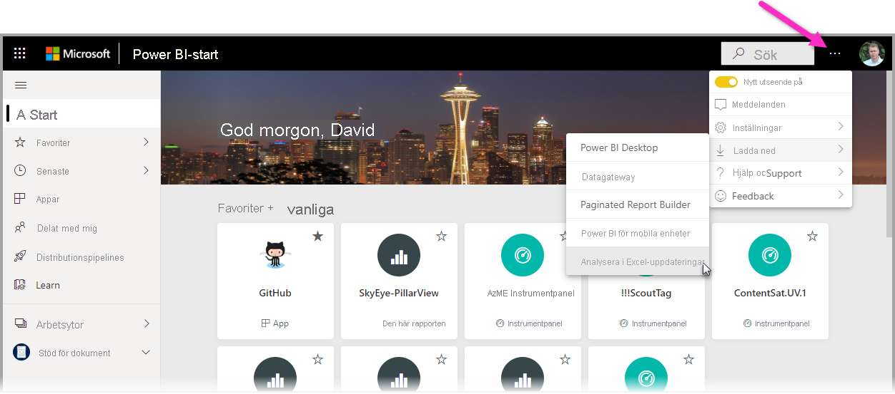
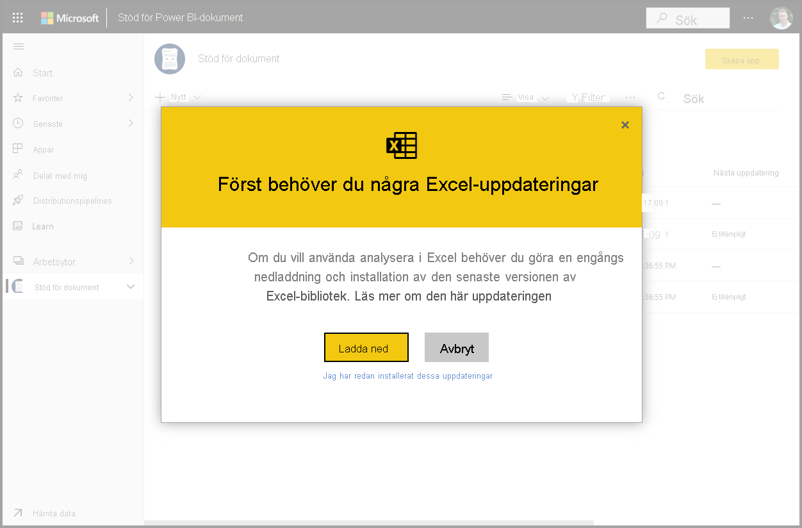
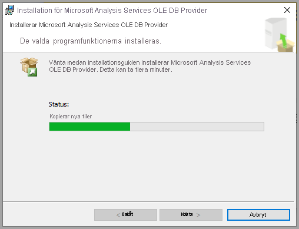
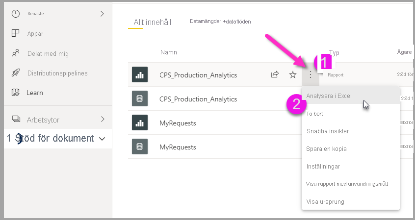
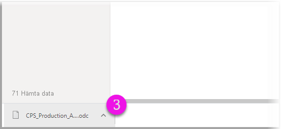
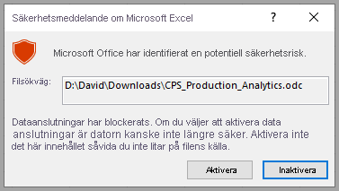
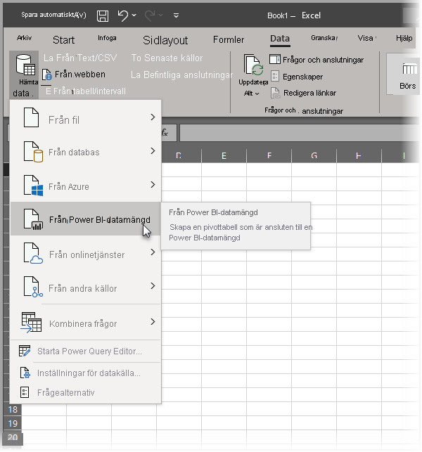

# Analysera i Excel
Med **Analysera i Excel** kan du placera Power BI-datauppsättningar i Excel och sedan visa dem och interagera med dem med hjälp av pivottabeller, diagram, utsnitt och andra Excel-funktioner. Om du vill använda **Analysera i Excel** måste du först hämta funktionen från Power BI, installera den och sedan välja en eller flera datauppsättningar som ska användas i Excel. 

Den här artikeln visar hur du installerar och använder Analysera i Excel, beskriver dess begränsningar och ger sedan några nästa steg. Det här får du lära dig:

* [Installera Analysera i Excel](#install-analyze-in-excel)
* [Anslut till Power BI-data](#connect-to-power-bi-data)
* [Använda Excel för att analysera data](#use-excel-to-analyze-the-data)
* [Spara och dela din arbetsbok](#saving-and-sharing-your-new-workbook)
* [Krav](#requirements)

Nu ska vi gå vidare och få igång installationsprocessen.

## Installera Analysera i Excel

Du måste installera **Analysera i Excel** från länkar som finns i Power BI-tjänsten. Power BI identifierar den version av Excel som du har på din dator och hämtar automatiskt rätt version (32-bitars eller 64-bitars). Power BI-tjänsten körs i en webbläsare. Du kan logga in på Power BI med hjälp av följande länk:

* [Logga in i Power BI](https://app.powerbi.com)

När du har loggat in och Power BI-tjänsten körs i webbläsaren väljer du objektet **Fler alternativ** (...) i det övre högra hörnet och väljer sedan **Ladda ned > Analysera i Excel-uppdateringar**. Detta menyalternativ gäller för nya installationer av uppdateringar av Analysera i Excel.

Du kan också navigera i Power BI-tjänsten till en datauppsättning som du vill analysera och välja objektet **Fler alternativ** för en datauppsättning, en rapport eller ett annat Power BI-objekt. I menyn som visas väljer du alternativet **Analysera i Excel**, som du ser i följande bild.

Oavsett hur du gör identifierar Power BI om du har Analysera i Excel installerat och om så inte är fallet uppmanas du att ladda ned det. 

När du väljer Hämta, identifierar Power BI den version av Excel som du har installerat och laddar ned lämplig version av Analysera i Excel-installationsprogrammet. Du ser en nedladdningsstatus längst ned i webbläsaren, eller när webbläsaren visar hämtningsförloppet. 

När hämtningen är klar kör du installationsprogrammet (.msi) för att installera Analysera i Excel. Namnet på installationsprocessen skiljer sig från Analysera i Excel. Namnet kommer att vara **Microsoft Analysis Services OLE DB-provider** såsom visas på följande bild, eller något liknande.

När den är klar är du redo att välja en rapport i Power BI-tjänsten (eller något annat Power BI-dataelement, t.ex. en datauppsättning) och sedan analysera den i Excel.

## Anslut till Power BI-data

I Power BI-tjänsten navigerar du till den datauppsättning eller rapport som du vill analysera i Excel och väljer menyn **Fler alternativ** (...) för att hitta menyalternativet **Analysera i Excel**. Följande bild visar hur du väljer en rapport.

Det finns några steg för att hämta en datauppsättning från Power BI-tjänsten till Excel:

1. Välj menyn **Fler alternativ**.
2. Välj **Analysera i Excel** från menyalternativen som visas.

    Power BI-tjänsten skapar sedan en fil av datauppsättningen som är utformad (och strukturerad) för användning med **Analysera i Excel** som har filtillägget ODC. Filen skapas och startar sedan automatiskt en nedladdningsprocess i webbläsaren.
    
    
    
    Filnamnet matchar datauppsättningen (eller rapporten eller någon annan datakälla) som den härleds från. Så om rapporten kallades *Senaste-försäljning*, skulle den nedladdade filen heta **Senaste-försäljning.ODC**.

3. Starta ODC-filen

Filen är redan kopplad till **Analysera i Excel**, så när du väljer eller startar ODC-filen, startas Excel och börjar automatiskt läsa in ODC-filen. Du kommer troligen få en varning om ett hot från en extern datakälla:

Välj **Aktivera** för att läsa in ODC-filen för **Analysera i Excel** och Excel läser in filen. 

## Använda Excel för att analysera data

När du tillåter ODC-filen som ska läsas in genom att välja **Aktivera** från säkerhetsmeddelandet visas en tom lista för **Pivottabell** och **Fält** från Power BI-datauppsättningen som är redo att analyseras.

Odc-filen har en MSOLAP-anslutningssträng som ansluter till din datauppsättning i Power BI. När du analyserar eller arbetar med dina data, ställer Excel frågor till datauppsättningen i Power BI och returnerar resultaten till Excel. Om datauppsättningen ansluter till en datakälla i realtid med hjälp av DirectQuery, frågar Power BI datakällan och returnerar resultatet till Excel.

Med anslutningen till data i Power BI som nu upprättats kan du skapa pivottabeller och diagram och analysera din datauppsättning precis som om du arbetade med en lokal datauppsättning i Excel.

**Analysera i Excel** är särskilt användbart för datauppsättningar och rapporter som ansluter till följande datakällor:

* *Analysis Services-tabell* eller *flerdimensionella* databaser
* Power BI Desktop-filer eller Excel-arbetsböcker med datamodeller som har modellmått som skapats med hjälp av dataanalysuttryck (DAX).

> [!IMPORTANT]
> Använda **Analysera i Excel** visar alla data på detaljnivå för alla användare med behörighet till datamängden.

Det finns några saker att tänka på när du börjar använda Analysera i Excel, vilket kan kräva ett extra steg eller två för att stämma av. Dessa möjligheter beskrivs i följande avsnitt. 

### Logga in i Power BI
Även om du är inloggad i Power BI i webbläsaren, kan du första gången du öppnar en ny odc-fil i Excel bli ombedd att logga in i Power BI med ditt Power BI-konto. Detta autentiserar anslutningen från Excel till Power BI.

### Användare med flera Power BI-konton
Vissa användare har flera Power BI-konton. Om du har det, kanske du är inloggad på Power BI med ett konto, men ditt andra konto har åtkomst till datauppsättningen som används i Analysera i Excel. I detta fall kanske du får ett meddelande om **förbud** eller inloggningsfel när du försöker komma åt en datauppsättning som används i en Analysera i Excel-arbetsbok.

Om detta sker får du en ny möjlighet att logga in och då kan du logga in med det Power BI-konto som har åtkomst till datauppsättningen som används av Analysera i Excel. Du kan även välja ditt namn i det övre menyfliksområdet i Excel, som identifierar vilket konto du för närvarande är inloggad med. Logga ut och logga in igen med det andra kontot.

## Spara och dela din nya arbetsbok

Du kan **Spara** Excel-arbetsboken som du skapar med Power BI-datauppsättningen, precis som med andra arbetsböcker. Du kan dock inte publicera eller importera arbetsboken tillbaka till Power BI eftersom du bara kan publicera eller importera arbetsböcker till Power BI som har data i tabeller eller som har en datamodell. Eftersom den nya arbetsboken bara har en anslutning till datauppsättningen i Power BI, skulle det bara vara att gå runt i cirklar att publicera eller importera den till Power BI!

När din arbetsbok har sparats kan du dela den med andra Power BI-användare i din organisation. 

När en användare som du har delat arbetsboken med öppnar den, ser hen dina pivottabeller och data som de visades när arbetsboken senast sparades, vilket inte nödvändigtvis är den senaste versionen av dina data. För att hämta den senaste versionen av dina data måste användaren använda knappen **Uppdatera** på menyfliken **Data**. Och eftersom arbetsboken ansluter till en datauppsättning i Power BI, måste användare som försöker uppdatera arbetsboken logga in i Power BI och installera Excel-uppdateringarna första gången de försöker uppdatera med den här metoden.

Eftersom användarna måste uppdatera datauppsättningen, och uppdatering för externa anslutningar inte stöds i Excel Online, rekommenderar vi att användarna öppnar arbetsboken i skrivbordsversionen av Excel på datorn.

> [!NOTE]
> Administratörer för Power BI-klienter kan använda *Power BI-administratörsportalen* för att inaktivera användningen av **Analysera i Excel** med lokala datauppsättningar som förvaras i Analysis Services-databaser. När alternativet är inaktiverat, är **Analysera i Excel** inaktiverat för Analysis Services-databaser, men fortsätter att vara tillgängligt för användning med andra datauppsättningar.

## Andra sätt att komma åt Power BI-datauppsättningar från Excel
Användare med vissa Office SKU:er kan också ansluta till Power BI-datauppsättningar inifrån Excel med hjälp av funktionen **Hämta data** i Excel. Om SKU:n inte stöder den här funktionen visas inte menyalternativet **Hämta data**.

Från menyfliksområdet **Data** väljer du **Hämta data > Från Power BI-datauppsättning** såsom visas på följande bild.

Ett fönster visas där du kan bläddra bland datauppsättningar som du har åtkomst till, se om datauppsättningar är certifierade eller upphöjda och avgöra om dataskyddsetiketter har tillämpats på dessa datauppsättningar. 

Mer information om hur du hämtar data till Excel på det här sättet finns i [Skapa en pivottabell från Power BI-datauppsättningar](https://support.office.com/article/31444a04-9c38-4dd7-9a45-22848c666884) i Excel-dokumentationen.

Du kan också komma åt **aktuella tabeller** i Excel, i galleriet **Datatyper**. Mer information om aktuella tabeller och hur du kommer åt dem finns i [Åtkomst till aktuella Power BI-tabeller i Excel (förhandsversion)](service-excel-featured-tables.md).

## Krav
Det finns några krav för att använda **Analysera i Excel**:

* **Analysera i Excel** stöds för Microsoft Excel 2010 SP1 och senare.

* Pivottabeller i Excel stöder inte dra och släpp-aggregering av numeriska fält. Datauppsättningen i Power BI *måste ha fördefinierade mått*. Läs om att [skapa mått](../transform-model/desktop-measures.md).
* Vissa organisationer kan ha grupprincipregler som förhindrar installation av nödvändiga **Analysera i Excel**-uppdateringar i Excel. Kontrollera med administratören om det inte går att installera uppdateringarna.
* **Analysera i Excel** kräver att datauppsättningen finns i Power BI Premium eller att användaren har en Power BI Pro-licens. Mer information om skillnaderna i funktionalitet mellan de olika licenstyperna finns i _Jämförelse av Power BI-funktioner_ i [Power BI-prissättning](https://powerbi.microsoft.com/pricing/).
* Användare kan ansluta till datamängder via Analysera i Excel om de har behörighet till den underliggande datamängden.  En användare kan ha sådan behörighet på flera olika sätt, till exempel genom att vara medlem i arbetsytan som innehåller datamängden, få en rapport eller instrumentpanel delad till sig där datamängden används eller ha skapandebehörighet till datamängden via en arbetsyta eller app som innehåller datamängden. Läs mer om [behörigheten Skapa](../connect-data/service-datasets-build-permissions.md) för datamängder.
* Gästanvändare kan inte använda **Analysera i Excel** för datamängder som skickas från (har sitt ursprung i) en annan klientorganisation. 
* **Analysera i Excel** är en funktion i Power BI-tjänsten och är inte tillgänglig i Power BI Report Server eller Power BI Embedded. 
* **Analysera i Excel** stöds bara för datorer som kör Microsoft Windows.

För användare som behöver avinstallera funktionen **Analysera i Excel** kan du göra det med hjälp av systeminställningen **Lägg till eller ta bort program** på Windows-datorn.

## Felsökning
Det kan finnas tillfällen när Analysera i Excel ger ett oväntat resultat eller funktionen inte fungerar som väntat. [Den här sidan innehåller lösningar för vanliga problem när du använder Analysera i Excel](desktop-troubleshooting-analyze-in-excel.md).

## Nästa steg

Följande artiklar kan också vara av intresse för dig:

* [Använd visning av detaljerad information mellan rapporter i Power BI Desktop](../create-reports/desktop-cross-report-drill-through.md)
* [Använda utsnitt i Power BI Desktop](../visuals/power-bi-visualization-slicers.md)
* [Felsöka Analysera i Excel](desktop-troubleshooting-analyze-in-excel.md)
* [Använda aktuella Power BI-tabeller i Excel (förhandsversion)](service-excel-featured-tables.md).

