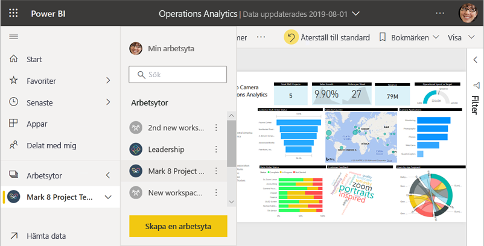
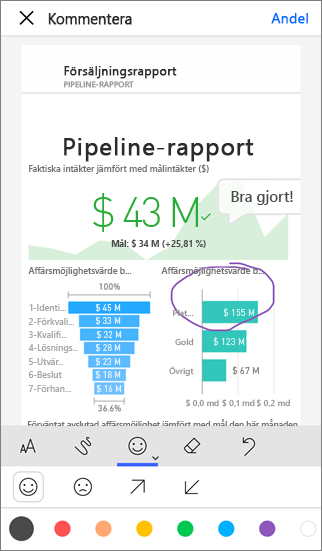

# Olika sätt att dela ditt arbete i Power BI

Du har skapat instrumentpaneler och rapporter. Du kanske även använder dem för att samarbeta med dina kollegor. Nu vill du att andra ska ha åtkomst till dem. Vad är det bästa sättet att distribuera dem? I artikeln jämför vi alternativen för att samarbeta och dela i Power BI:

* Samarbeta med kollegor och skapa meningsfulla rapporter och instrumentpaneler på *arbetsytor*.
* Paketera dessa instrumentpaneler och rapporter i *appar* och distribuera dem till en större grupp eller hela organisationen.
* Skapa *delade datauppsättningar* som dina kollegor kan använda som grund för egna rapporter på egna arbetsytor.
* Dela instrumentpaneler och rapporter med några få personer från tjänsten eller via Power BI-mobilappar.
* Kommentera och dela från Power BI-mobilapparna.
* Bädda in en rapport i Microsoft Teams.
* Skriv ut rapporter.
* *Bädda in* rapporter i säkra portaler eller på offentliga webbplatser.
* Skapa en *mallapp* som du kan distribuera till externa Power BI-användare via Microsoft AppSource.

Oavsett vilket alternativ du väljer för att dela ditt innehåll behöver du en [Power BI Pro-licens](../fundamentals/service-features-license-type.md) eller så måste innehållet finnas i en [Premium-kapacitet](../admin/service-premium-what-is.md). Licenskraven kan variera för de kollegor som visar ditt innehåll, beroende på vilket alternativ du väljer. Det följande avsnittet beskriver detta i större detalj. 

*Appar i Power BI-tjänsten*

## Samarbeta på en arbetsyta

När team arbetar tillsammans behöver de få åtkomst till samma dokument så att de snabbt kan samarbeta. På arbetsytor i Power BI kan arbetsgrupper samlas och dela ägarskap och hantering av viktiga instrumentpaneler, rapporter, datauppsättningar och arbetsböcker. Ibland organiserar Power BI-användare sina arbetsytor baserat på organisationsstrukturer, och i andra fall skapar de dem för särskilda projekt. Andra organisationer använder fortfarande flera arbetsytor för att lagra olika versioner av rapporter eller instrumentpaneler som de använder. 

Arbetsytor ger roller som bestämmer vilka behörigheter dina medarbetare har. Du kan använda de här rollerna till att bestämma vem som ska kunna hantera hela arbetsytan, redigera innehållet på den och distribuera innehållet till andra.

Du kanske ser det som naturligt att lägga innehåll i Min arbetsyta och dela det därifrån. Arbetsytor är dock bättre för samarbete än Min arbetsyta eftersom innehållet kan ägas av flera. Du och hela teamet kan enkelt göra uppdateringar eller ge andra användare åtkomst. Min arbetsyta är bäst lämpat för enskilda användare som lägger till personligt innehåll eller innehåll som används en enstaka gång.

Låt oss anta att du har en färdig instrumentpanel som du behöver dela med dina kollegor. Vad är det bästa sättet att ge dem åtkomst till instrumentpanelen? Svaret beror på ett antal faktorer. 

- Om dina kollegor behöver hålla instrumentpanelen uppdaterad eller behöver åtkomst till allt innehåll på arbetsytan kan du överväga att lägga till dem på arbetsytan. 
- Om dina kollegor bara behöver se just den instrumentpanelen och inte allt innehåll på arbetsytan har du återigen flera alternativ. Om bara några få personer behöver tillgång till instrumentpanelen kan den bästa lösningen vara att dela instrumentpanelen.
- Om instrumentpanelen däremot ingår i en större mängd innehåll som du behöver distribuera till många kollegor är det förmodligen bäst att publicera en *app*.

Power BI har en ny arbetsyta. Läs mer om ändringarna i [Skapa de nya arbetsytorna](service-create-the-new-workspaces.md). 

## Distribuera insikter i en app

Anta att du vill distribuera din instrumentpanel till en bred publik i organisationen. Du och dina medarbetare har skapat en *arbetsyta* och skapat och förfinat instrumentpaneler, rapporter och datauppsättningar på arbetsytan. Nu väljer du de instrumentpaneler och rapporter du vill ha och publicerar dem som en app – antingen till en grupp eller till hela organisationen.

Apparna är lätta att hitta och installera på Power BI-tjänsten ([https://app.powerbi.com](https://app.powerbi.com)). Du kan skicka en direktlänk till appen till dina företagsanvändare eller de kan söka efter den i AppSource. Om din Power BI-administratör ger dig behörighet kan du installera en app automatiskt på din medarbetares Power BI-konton. Läs mer om att [publicera dina appar](service-create-distribute-apps.md).

När de har installerat en app kan de se den i webbläsaren eller på mobilenheten.

För att användare ska kunna se din app måste de antingen ha en Power BI Pro-licens eller också måste appen lagras på en Power BI Premium-kapacitet. Läs [Vad är Power BI Premium?](../admin/service-premium-what-is.md) för mer information.

Du kan även publicera appar till dem som är utanför din organisation. De kan visa och interagera med appinnehållet men kan inte dela det med andra. Nu kan du skapa *mallappar* och distribuera dem till valfri Power BI-kund.

## Dela en datauppsättning

Vissa personer är helt enkelt bättre på att skapa väl utformade datamodeller av hög kvalitet i sina rapporter. Du kanske är en sådan person. Hela organisationen kan ha nytta av att använda samma väl utformade datamodeller. Det är här som *delade datamängder* kommer in. När du skapar en rapport med en datamodell som alla bör kunna använda kan du spara rapporten i Power BI-tjänsten och ge rätt personer behörighet att använda den. Sedan kan de skapa egna rapporter baserade på din datamängd. På så sätt baserar alla sina rapporter på samma data och ser samma ”version av sanningen”.

Läs mer om att [skapa och använda delade datamängder](../connect-data/service-datasets-across-workspaces.md).

## Dela instrumentpaneler och rapporter

Anta att du har skapat en instrumentpanel och en rapport på din egen Min arbetsyta eller på en arbetsyta och du vill att några andra personer ska ha åtkomst till den. Ett sätt att komma åt den är att *dela* den. 

Du behöver en Power BI Pro-licens för att dela innehåll, liksom de som du delar det med. Annars måste innehållet vara på en arbetsyta i en [Premium-kapacitet](../admin/service-premium-what-is.md). När du delar en instrumentpanel eller rapport kan mottagare som du delar med se den och interagera med den, men inte redigera den. De ser samma data som du ser på instrumentpanelen eller i rapporten och får åtkomst till alla data i den underliggande datauppsättningen, såvida inte [säkerhet på radnivå (RLS)](../admin/service-admin-rls.md) tillämpas. De medarbetare som du delar den med kan dela den med sina medarbetare, om du tillåter dem att göra så. 

Du kan dela en instrumentpanel med personer utanför din organisation. De kan även visa och interagera med instrumentpanelen eller rapporten, men de kan inte dela den. 

Mer om att [dela instrumentpaneler och rapporter](service-share-dashboards.md) från Power BI-tjänsten. Du kan också lägga till ett filter till en länk och [dela en filtrerad vy av rapporten](service-share-reports.md).

## Kommentera och dela från Power BI-mobilapparna

Du kan kommentera på en panel, rapport eller visualisering och sedan dela den med vem som helst med hjälp av Power BI-mobilapparna för iOS- och Android-enheter.

Du delar en ögonblicksbild av paneler, rapporten eller visualiseringen och mottagarna ser den precis som den var när du skickade e-postmeddelandet. E-postmeddelandet innehåller också en länk till instrumentpanelen eller rapporten. Om de har en licens för Power BI Pro, eller om innehållet ligger i en [Premium kapacitet](../admin/service-premium-what-is.md), och du redan har delat objektet med dem, kan de öppna den. Du kan skicka ögonblicksbilder av paneler till alla &#151; inte bara medarbetare i samma e-postdomän.

Mer om [delning och kommentering för paneler, rapporter och visuella objekt](../consumer/mobile/mobile-annotate-and-share-a-tile-from-the-mobile-apps.md) från iOS- och Android-appar.

Du kan också [dela en ögonblicksbild av en panel](../consumer/mobile/mobile-windows-10-phone-app-get-started.md) från Power BI-appen för Windows 10-enheter.

## Bädda in en rapport i Microsoft Teams

Öka det datadrivna samarbetet i din organisation genom att bädda in Power BI-rapporter och sidnumrerade Power BI-rapporter i Microsoft Teams. Du kan lägga till separata Power BI-flikar för varje enskild rapport och ge varje flik rapportens namn eller något annat namn. Dina kollegor kan visa dina rapporter på Power BI-flikarna i Teams. De kan också öppna konversationsfönstret och kommentera rapporten direkt i Teams. Läs mer om hur du [bäddar in en rapport i Microsoft Teams](service-embed-report-microsoft-teams.md).

## Skriva ut eller spara som PDF eller andra statiska filer

Du kan skriva ut eller spara som PDF (eller andra statiska filformat) hela instrumentpaneler, paneler, rapportsidor eller visualiseringar från Power BI-tjänsten. Rapporter kan bara skrivas ut en sida i taget – det går inte att skriva ut hela rapporten på samma gång. Mer om att [skriva ut eller spara som en statisk fil](../consumer/end-user-print.md).

## Bädda in rapporter i säkra portaler eller på offentliga webbplatser

### Bädda in i säkra portaler

Du kan bädda in Power BI-rapporter i portaler eller på webbplatser där dina användare förväntar sig att se dem.  
Alternativen **Bädda in i SharePoint Online** och **Bädda in** i Power BI-tjänsten gör det möjligt att bädda in rapporter för dina interna användare på ett säkert sätt. 

- **Bädda in i SharePoint Online** fungerar med Power BI-webbdelen för SharePoint Online. Där får du enkel inloggning med kontroll över hur rapporten bäddas in. 
- **Bädda in** fungerar med valfri portal eller webbplats som har stöd för att bädda in innehåll via webbadresser eller en iFrame. 

Oavsett vilket alternativ du väljer tillämpar Power BI alla behörigheter och gällande datasäkerhet innan användarna kan se innehållet. Personen som visar rapporten måste ha rätt licens. Mer information om att [bädda in i SharePoint Online](service-embed-report-spo.md) och alternativet [Bädda in](service-embed-secure.md) i Power BI.

### Publicera till offentliga webbplatser

Med **Publicera på webben** kan du publicera Power BI-rapporter till hela internet genom att bädda in interaktiva visualiseringar i blogginlägg, på webbplatser, i sociala medier och i andra former av onlinekommunikation på valfri enhet. Alla på Internet kan se dina rapporter och du har ingen kontroll över vem som kan se vad du har publicerat. De behöver inte en licens för Power BI. Du kan bara publicera rapporter som du kan redigera på webben. Du kan inte publicera rapporter på webben om de har delats med dig eller om de finns i en app. Mer om att [publicera på webben](service-publish-to-web.md).

>[!Warning]
>Använd endast [Publicera på webben](service-publish-to-web.md) för att dela innehåll offentligt, inte för intern delning.

## Skapa och distribuera mallappar

*Mallappar* är utformade för att distribueras offentligt, ofta i Microsoft AppSource. Du skapar en app och kan distribuera den till valfri Power BI-kund praktiskt taget utan kodning. Dina kunder ansluter till sina egna data och skapar instanser av sina egna konton. Läs mer om [mallappar i Power BI](../connect-data/service-template-apps-overview.md).

## Nästa steg

* [Dela instrumentpaneler med kollegor och andra](service-share-dashboards.md)
* [Skapa och publicera en app i Power BI](service-create-distribute-apps.md)
* [Bädda in en rapport i en säker portal eller på en webbplats](service-embed-secure.md)

Har du feedback till oss? Gå till [Power BI Community-webbplatsen](https://community.powerbi.com/) med dina förslag.

Har du fler frågor? [Prova Power BI Community](https://community.powerbi.com/)
