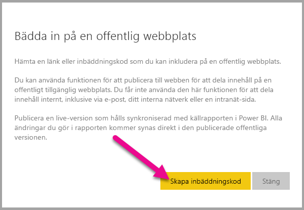
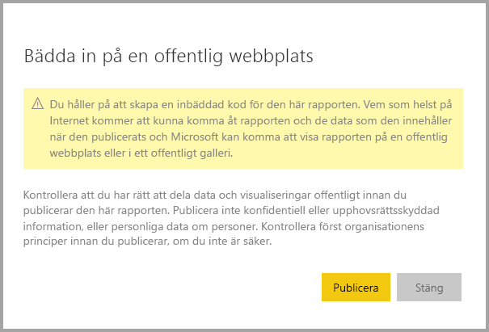
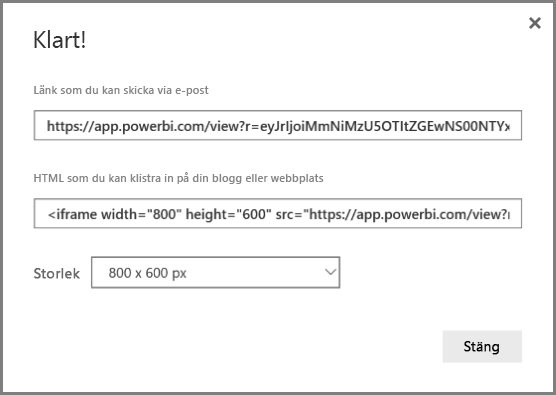
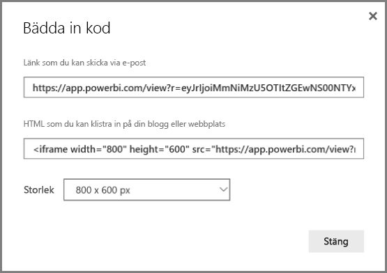
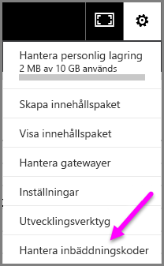
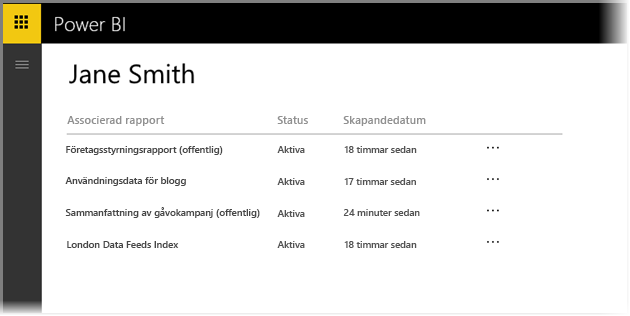
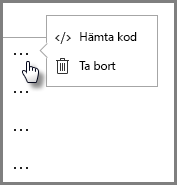
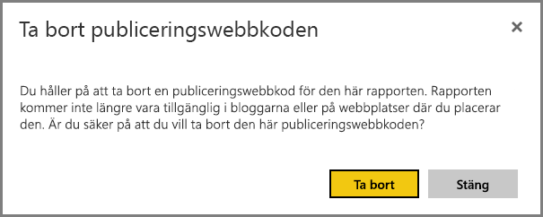

# Publicera på webben från Power BI

Med alternativet **Publicera på webben** i Power BI kan du enkelt bädda in interaktivt Power BI-innehåll i blogginlägg, på webbplatser, i e-post eller på sociala medier. Du kan också enkelt redigera, uppdatera eller sluta dela publicerade visuella objekt.

> [!WARNING]
> När du använder **Publicera på webben** kan vem som helst på Internet titta på din publicerade rapport eller ditt visuella objekt. Visning kräver ingen autentisering. Detta inkluderar visning av data på detaljnivå som sammanställs i dina rapporter. Innan du publicerar en rapport bör du kontrollera att det går bra att du delar data och visualiseringar offentligt. Publicera inte konfidentiell eller upphovsrättsskyddad information. Om du tvekar, så kontrollera först organisationens principer innan du publicerar.

>[!Note]
>Du kan bädda in ditt innehåll på ett säkert sätt på en intern portal eller webbplats. Använd alternativen [Bädda in](service-embed-secure.md) eller [Bädda in i SharePoint Online](service-embed-report-spo.md). Dessa alternativ säkerställer att alla behörigheter och all datasäkerhet tillämpas när dina användare visar dina interna data.

## Skapa inbäddningskoder med Publicera på webben

**Publicera på webben** är tillgängligt för rapporter som du kan redigera på dina personliga arbetsytor och grupparbetsytor.  Det är inte tillgängligt för rapporter som delas med dig eller sådana som använder säkerhet på radnivå för att skydda data. I avsnittet [**Begränsningar**](#limitations) nedan finns en fullständig lista över fall där **Publicera på webben** inte stöds. Läs avsnittet **Varning** tidigare i den här artikeln innan du använder **Publicera på webben**.

Följande korta video visar hur den här funktionen fungerar. Sedan kan du prova själv med stegen nedan.

<iframe width="560" height="315" src="https://www.youtube.com/embed/UF9QtqE7s4Y" frameborder="0" allowfullscreen></iframe>

Följande steg beskriver hur du använder **Publicera på webben**.

1. Öppna en rapport på en arbetsyta som du kan redigera och välj **Fler alternativ (...)**   > **Bädda in** > **Publicera på webben (offentligt)** .

   
   
2. Om din Power BI-administratör inte har tillåtit att du skapar inbäddningskoder kan du behöva kontakta dem.

   
   
   Information om hur du hittar den person som kan aktivera Publicera på webben i din organisation finns i [Så här hittar du din Power BI-administratör](#find-your-power-bi-administrator) längre fram i den här artikeln.

3. Granska innehållet i dialogrutan och välj **Skapa inbäddningskod**.

   

4. Läs den varning som visas här och bekräfta att det är OK om dessa data bäddas in på en offentlig webbplats. Välj **Publicera** om så är fallet.

   

5. En dialogruta visas med en länk. Välj länken för att skicka den via e-post eller kopiera HTML-koden. Du kan bädda in den i kod såsom en iFrame, eller klistra in den direkt på en webbplats eller blogg.

   

6. Om du tidigare skapade en inbäddningskod för en rapport och väljer **Publicera på webben** ser du inte dialogrutorna i steg 2–4. I stället visas dialogrutan **Inbäddningskod**:

   

   Du kan bara skapa en inbäddningskod för varje rapport.

### Tips för visningslägen

När du bäddar in innehåll i ett blogginlägg behöver du normalt få det att rymmas inom en viss skärmstorlek.  Du kan justera höjden och bredden i iFrame-taggen efter behov. Dock behöver du se till att rapporten ryms i det aktuella iFrame-området. Därför behöver du även ange ett lämpligt visningsläge när du redigerar rapporten.

Följande tabell innehåller råd om visningsläget och hur det ser ut när det är inbäddat.

| Visningsläge | Hur det ser ut när det är inbäddat |
| --- | --- |
|  |**Anpassa till sida** tar hänsyn till rapportens sidhöjd och sidbredd. Om du ställer in sidan på *dynamiska* förhållanden såsom 16:9 eller 4:3, så skalas innehållet så att det passar i iFrame. Vid inbäddning i en iFrame kan användning av **Anpassa till sida** resultera i *letterbox-format*, där en grå bakgrund visas i iFrame-områden när innehållet har skalats för att rymmas i iFrame. Om du vill minimera letterbox-formatet anger du lämplig höjd och bredd för iFrame. |
|  |**Faktisk storlek** säkerställer att rapporten bevarar den storlek som angetts på rapportsidan. Detta kan resultera i rullningslister i iFrame. Ange höjd och bredd för iFrame så att du kan undvika rullningslister. |
|  |**Anpassa till bredd** säkerställer att innehållet passar det vågräta iFrame-området. En kant visas fortfarande, men innehållet skalas så att allt tillgängligt vågrätt utrymme används. |

### Tips för höjd och bredd i iFrame

En inbäddningskod för **Publicera på webben** ser ut som i följande exempel:

 
Du kan redigera bredd och höjd manuellt så att det blir exakt som du vill att det ska passa in på den sida där du bäddar in.

Du kan prova att lägga till 56 bildpunkter till iFrame-höjden för att ta hänsyn till det nedre fältets aktuella storlek och uppnå en mer exakt anpassning. Om din rapportsida använder dynamisk storlek kan du använda någon av storlekarna i tabellen nedan för att uppnå en anpassning utan letterbox-format.

| Proportion | Storlek | Dimension (bredd x höjd) |
| --- | --- | --- |
| 16:9 |Liten |640 x 416 px |
| 16:9 |Medium |800 x 506 px |
| 16:9 |Stor |960 x 596 px |
| 4:3 |Liten |640 x 536 px |
| 4:3 |Medium |800 x 656 px |
| 4:3 |Stor |960 x 776 px |

## Hantera inbäddningskoder

När du skapar en inbäddningskod för **Publicera på webben** kan du hantera koderna på menyn **Inställningar** i Power BI. Hantering av inbäddningskoder omfattar möjligheten att ta bort målvisualiseringen eller -rapporten för en kod (vilket gör inbäddningskoden oanvändbar) eller hämta inbäddningskoden.

1. Om du vill hantera dina inbäddningskoder för **Publicera på webben** öppnar du **Inställningar** och väljer **Hantera inbäddningskoder**.

   

2. Inbäddningskoderna visas.

   

3. Du kan antingen hämta eller ta bort en inbäddningskod. Om du tar bort den inaktiverar eventuella länkar till den rapporten eller visualiseringen.

   

4. Om du väljer **Ta bort** uppmanas du att bekräfta.

   

## Uppdateringar av rapporter och datauppdatering

När du har skapat inbäddningskoden för **Publicera på webben** och delat den uppdateras rapporten med eventuella ändringar som du gör, och länken för inbäddningskoden blir aktiv omedelbart. Alla som öppnar länken kan visa den. Efter den här inledande åtgärden kan dock uppdateringar av rapporter eller visuella objekt ta två till tre timmar innan de blir synliga för användarna. Mer information finns i avsnittet [**Så här fungerar det**](#howitworks) längre fram i den här artikeln. 

### Datauppdatering

Datauppdateringarna återspeglas automatiskt i din inbäddade rapport eller visuella objekt. Det kan ta ungefär en timme för uppdaterade data att bli synliga från inbäddningskoder. Du kan inaktivera automatisk uppdatering genom att välja **Uppdatera inte** på schemat för den datamängd som används av rapporten.  

## Visuella objekt för Power BI

Visuella Power BI-objekt stöds i **Publicera på webben**. När du använder **Publicera på webben** behöver inte användare som du delar det publicerade visuella objektet med aktivera visuella Power BI-objekt för att kunna visa rapporten.

## Förstå statuskolumnen för inbäddningskod

>[!Note]
>Granska de inbäddningskoder som du har publicerat ofta. Ta bort de som inte längre behöver vara tillgängliga offentligt.

Sidan **Hantera inbäddningskoder** innehåller en statuskolumn. Som standard är inbäddningskoder **aktiva**, men de kan även ha någon av de statusar som anges nedan.

| Status | Beskrivning |
| --- | --- |
| **Aktiv** |Rapporten är tillgänglig för Internet-användare kan visa och interagera med den. |
| **Blockerad** |Rapportinnehållet strider mot [användningsvillkoren för Power BI](https://powerbi.microsoft.com/terms-of-service). Microsoft har blockerat det. Kontakta supporten om du tror att innehållet har blockerats av misstag. |
| **Stöds ej** |Rapportens datauppsättning använder säkerhet på radnivå eller en annan konfiguration som inte stöds. En fullständig lista finns i avsnittet [**Begränsningar**](#limitations). |
| **Intrång** |Inbäddningskoden ligger utanför den definierade klientorganisationsprincipen. Denna status inträffar vanligtvis när en inbäddningskod har skapats och klientorganisationsinställningen **Publicera på webben** ändrats till att exkludera den användare som äger inbäddningskoden. Om klientorganisationsinställningen är inaktiverad, eller om användaren inte längre kan skapa inbäddningskoder, visar befintliga inbäddningskoder statusen **Intrång**. Mer information finns i avsnittet [Hitta din Power BI-administratör](#find-your-power-bi-administrator) i den här artikeln. |

## Rapportera ett problem med innehåll för Publicera på webben

Om du vill rapportera ett problem som rör **Publicera på webben** och innehåll som har bäddats in på en webbplats eller i en blogg, så använd **flaggikonen** i det nedre fältet i **Publicera på webben**-rapporten.

Du ombeds att skicka ett e-postmeddelande till Microsoft som förklarar problemet. Microsoft utvärderar innehållet baserat på [användningsvillkoren för Power BI](https://powerbi.microsoft.com/terms-of-service) och vidtar lämpliga åtgärder.

## Licensiering

Du måste vara en Microsoft Power BI-användare för att kunna använda **Publicera på webben**. Rapportens läsare behöver inte vara Power BI-användare.

## Så här fungerar det (teknisk information)

När du skapar en inbäddningskod med hjälp av **Publicera på webben** görs rapporten synlig för Internetanvändare. Den är offentligt tillgänglig, så du kan förvänta dig att användarna enkelt kan dela rapporten via sociala medier i framtiden. När användarna visar rapporten, antingen genom att öppna den offentliga URL:en direkt, eller visa den inbäddad på en webbsida eller i en blogg, så cachelagrar Power BI rapportdefinitionen och resultaten för de frågor som krävs för att visa rapporten. Denna cachelagring säkerställer att tusentals samtidiga användare kan visa rapporten utan att påverka prestanda.

Cacheminnet är långlivat. Om du uppdaterar rapportdefinitionen (genom att t.ex. ändra dess visningsläge) eller uppdaterar rapportdata, så kan det ta ungefär en timme innan ändringarna avspeglas i den version av rapporten som användarna ser. Eftersom varje element och datavärde cachelagras separat, när en datauppdatering sker, kan en blandning av aktuella och tidigare värden visas för en användare. Därför rekommenderar vi att du mellanlagrar ditt arbete i förväg och skapa inbäddningskoden för **Publicera på webben** enbart när du är nöjd med inställningarna. Om dina data kommer att uppdateras minimerar du antalet uppdateringar och utför uppdateringarna utanför arbetstid.

## Hitta din Power BI-administratör

Power BI-administratörsportalen har inställningar som styr vem som kan publicera på webben. Du behöver kontakta organisationens [Power BI-administratör](../admin/service-admin-role.md) om du vill ändra [Klientinställningar för publicera på webben](../admin/service-admin-portal.md#publish-to-web) i administratörsportalen.

För mindre organisationer eller individer som registrerat sig för Power BI kanske du inte har en Power BI-administratör ännu. Följ vår [process för klientadministratörsövertagande](https://docs.microsoft.com/azure/active-directory/users-groups-roles/domains-admin-takeover). När du har en Power BI-administratör kan denne aktivera att skapa inbäddningskoder åt dig.

Etablerade organisationer har vanligtvis redan en Power BI-administratör. Personer i någon av följande roller kan fungera som Power BI-administratör:

- Globala administratörer
- Användare med rollen Power BI-tjänstadministratör i Azure Active Directory

Du behöver [hitta någon av dessa personer](https://docs.microsoft.com/office365/admin/admin-overview/admin-overview#who-has-admin-permissions-in-my-business) i din organisation och be dem att uppdatera [Klientinställningar för publicera på webben](../admin/service-admin-portal.md#publish-to-web) i administratörsportalen.

## Begränsningar

**Publicera på webben** stöds för de flesta datakällor och rapporter i Power BI-tjänsten. Följande typer av rapporter stöds dock inte för närvarande eller är inte tillgängliga med **Publicera på webben**:

- Rapporter som använder säkerhet på radnivå.
- Rapporter som använder en datakälla för Live-anslutning, som Analysis Services Tabular på lokala flerdimensionella Analysis Services och Azure Analysis Services.
- Rapporter som använder en [delad datauppsättning](../connect-data/service-datasets-across-workspaces.md), som lagras i en annan arbetsyta än rapporten.
- [Delade och certifierade datamängder](../connect-data/service-datasets-share.md).
- Rapporter om delas med dig direkt eller via ett organisationsinnehållspaket.
- Rapporter i en arbetsyta som du inte är redigeringsmedlem i.
- Visuella R-objekt stöds för närvarande inte i **Publicera på webben**-rapporter.
- Exportera data från visuella objekt i en rapport som har publicerats på webben.
- ArcGIS Maps för Power BI-visualiseringar.
- Rapporter som innehåller DAX-mått på rapportnivå.
- Datafrågemodeller för enkel inloggning.
- Skydda konfidentiell eller upphovsrättsskyddad information.
- Den automatiska autentiseringsfunktionen som tillhandahålls av alternativet **Bädda in** fungerar inte med Power BI JavaScript-API:et. När det gäller Power BI JavaScript-API:et använder du metoden [användaren äger data](../developer/embedded/embed-sample-for-your-organization.md) för inbäddning.

## Nästa steg

- [SharePoint Onlines rapportwebbdel](service-embed-report-spo.md) 

- [Bädda in en rapport på en säker portal eller webbplats](service-embed-secure.md)

Har du fler frågor? [Prova Power BI Community](https://community.powerbi.com/)

