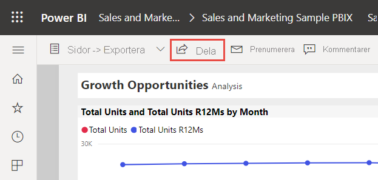
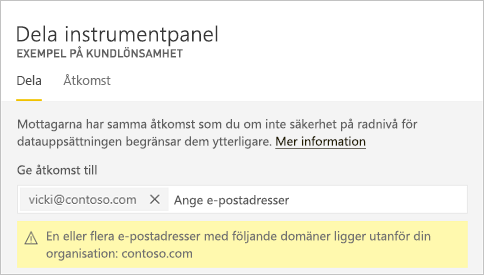
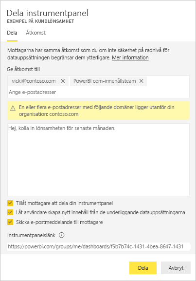
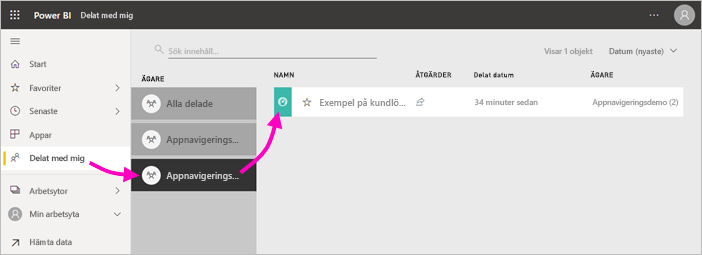
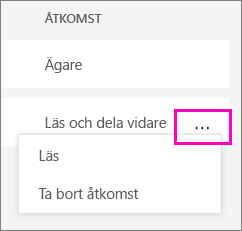
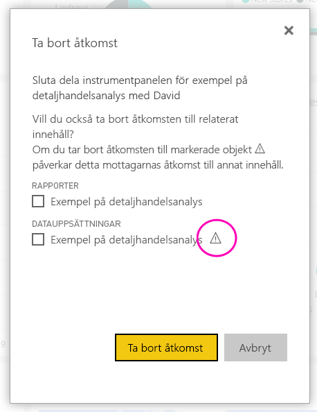

# Dela Power BI-instrumentpaneler och -rapporter med kollegor och andra
*Delning* är det enklaste sättet att ge användare åtkomst till dina instrumentpaneler och rapporter i Power BI-tjänsten. Du kan dela med personer i eller utanför din organisation.

När du delar en instrumentpanel eller en rapport kan de som du delar med se den och interagera med den, men inte redigera den. De ser samma data som du ser på instrumentpanelen och i rapporterna och får åtkomst till hela den underliggande datauppsättningen, såvida inte säkerhet på radnivå (RLS) tillämpas på den underliggande datauppsättningen.  De medarbetare som du delar med kan också dela den med sina medarbetare, om du tillåter detta. Personerna utanför organisationen kan också visa och interagera med instrumentpanelen eller rapporten, men de kan inte dela den. 

Du kan dela instrumentpaneler och rapporter från många platser i Power BI-tjänsten: Favoriter, senaste, min arbetsyta. Du kan också dela från andra arbetsytor om du har rollen [administratör, medlem eller deltagare](service-new-workspaces.md#roles-in-the-new-workspaces) i arbetsytan. Och du kan dela instrumentpaneler och rapporter i Delat med mig, om ägaren tillåter det. 

Power BI-tjänsten erbjuder även andra sätt att samarbeta och distribuera instrumentpaneler och rapporter på. Läs [Sätt att samarbeta och dela i Power BI](service-how-to-collaborate-distribute-dashboards-reports.md) och se vilket sätt som fungerar bäst för dina förhållanden. 

Med delning, vare sig om du delar innehåll i eller utanför din organisation, behöver du en [Power BI Pro-licens](../fundamentals/service-features-license-type.md). Mottagarna behöver också Power BI Pro-licenser, såvida inte innehållet finns i en [Premium-kapacitet](../admin/service-premium-what-is.md). 

Du kan inte *dela* direkt från Power BI Desktop. Du [publicerar rapporter från Power BI Desktop](../create-reports/desktop-upload-desktop-files.md) till Power BI-tjänsten. Du kan dock [dela en instrumentpanel från Power BI-mobilappar](../consumer/mobile/mobile-share-dashboard-from-the-mobile-apps.md).  

## Dela en instrumentpanel eller en rapport

1. Välj **Dela** :::image type="icon" source="../media/power-bi-share-icon.png" border="false"::: i en lista med instrumentpaneler eller rapporter, eller i en öppen instrumentpanel eller rapport.

2. Ange fullständiga e-postadresser för enskilda användare, distributionsgrupper och säkerhetsgrupper i den översta rutan. Du kan inte dela med dynamiska distributionslistor. 
   
   Du kan dela med användare vars postadresser finns utanför organisationen, men en varning visas. Du kan läsa mer om [delning utanför organisationen](#share-a-dashboard-or-report-outside-your-organization) i den här artikeln.
   
    
 
   >[!NOTE]
   >Textrutan för indata stöder högst 100 separata användare eller grupper. Om du vill veta hur du kan dela med fler personer kan du läsa [Dela med fler än 100 användare](#share-with-more-than-100-separate-users) i den här artikeln.

3. Lägg till ett meddelande om du vill. Det är valfritt.
4. Om du vill att dina medarbetare ska kunna dela innehåll med andra markerar du **Tillåt mottagarna att dela din instrumentpanel (eller rapport)** .
   
   Att låta andra dela kallas *dela om*. Om du låter dem göra det, kan de dela om från Power BI-tjänsten och de mobila apparna, eller vidarebefordra e-postinbjudan till andra i din organisation. Inbjudan upphör att gälla efter en månad. Personer utanför organisationen kan inte dela om. Som ägare av innehållet kan du inaktivera delning igen eller återkalla delning igen på individuell grund. Se [Avsluta eller ändra delning](#stop-or-change-sharing) i den här artikeln.

5. Om du väljer **Låt användare skapa nytt innehåll från de underliggande datauppsättningarna** kan de skapa egna rapporter i andra arbetsytor baserat på datamängden för instrumentpanelen. Läs mer om hur du [skapar rapporter baserat på datamängder från olika arbetsytor](../connect-data/service-datasets-discover-across-workspaces.md).

1. Välj **Dela.**
   
     
   
   Power BI skickar en e-postinbjudan till enskilda personer, men inte till grupper, med en länk till det delade innehållet. Du ser ett meddelande om att det **Lyckades**. 
   
   När mottagare i din organisation klickar på länken, så lägger Power BI till instrumentpanelen eller rapporten på sidan **Delat med mig**. De kan markera namnet för att se allt innehåll som du delar med dem. 
   
   
   
   När mottagare utanför organisationen klickar på länken kan de se instrumentpanelen eller rapporten, men inte i den vanliga Power BI-portalen. Du kan läsa mer om [delning med personer utanför organisationen](#share-a-dashboard-or-report-outside-your-organization) i den här artikeln.

## Se vem som har tillgång till en instrumentpanel eller en rapport
Ibland kan du behöva se vilka personer du har delat med, och se vilka de har delat den med.

1. Välj **Dela** :::image type="icon" source="../media/power-bi-share-icon.png" border="false"::: i listan med instrumentpaneler eller rapporter, eller i själva instrumentpanelen eller rapporten. 
2. I dialogrutan **Dela instrumentpanel** eller **Dela rapport** väljer du **Åtkomst**.
   
    

    Personer utanför organisationen listas som **Gäst**.

    I den här vyn kan du [sluta dela eller ändra delningsbehörigheter](#stop-or-change-sharing). 

## Dela en instrumentpanel eller en rapport utanför din organisation
När du delar med personer utanför organisationen får de ett e-postmeddelande med en länk till den delade instrumentpanelen eller rapporten. De måste logga in på Power BI för att se vad du har delat. Om de inte har någon Power BI Pro-licens kan de registrera sig för en licens efter att ha klickat på länken.

När de har loggat in visas den delade instrumentpanelen eller rapporten i ett eget webbläsarfönster, inte i den vanliga Power BI-portalen. För att komma åt den här instrumentpanelen eller rapporten senare behöver de lägga till länken som bokmärke.

De kan inte redigera något innehåll i den här instrumentpanelen eller rapporten. De kan interagera med diagram och ändra filter eller utsnitt, men kan inte spara ändringarna. 

Endast dina direkta mottagare kan se den delade instrumentpanelen eller rapporten. Om du t.ex. skickade e-postmeddelandet till Vicki@contoso.com, så kan endast Vicki se instrumentpanelen. Ingen annan kan se instrumentpanelen, även om Vicki vidarebefordrar länken till dem. Vicki måste använda samma e-postadress för att komma åt den. Om Vicki loggar in med någon annan e-postadress får hon inte åtkomst till instrumentpanelen.

Personer utanför organisationen kan inte se några data alls om säkerhet på roll- eller radnivå har implementerats på lokala Analysis Services-tabellmodeller.

Använd en säkerhetsgrupp, inte en distributionsgrupp, när du ska dela med en grupp som innehåller personer med externa e-postadresser. Personer med externa e-postmeddelanden i en distributionsgrupp kan inte se innehållet du delar, såvida de inte är gästanvändare i Azure Active Directory (Azure AD) B2B. Läs mer om [gästanvändare i Azure AD B2B](../admin/service-admin-azure-ad-b2b.md).

Om du skickar en länk från en Power BI-mobilapp till personer utanför organisationen öppnas instrumentpanelen i en webbläsare, inte i Power BI-mobilappen, om de klickar på länken.

### Tillåt att externa användare redigerar innehåll

Power BI-administratörer kan tillåta externa gästanvändare att redigera och hantera innehåll i organisationen. I så fall kommer dina externa användare inte att ha upplevelsen för enbart förbrukning. De kan redigera och hantera innehåll i din organisation. Läs mer om att [distribuera Power BI-innehåll till externa gästanvändare med Azure Active Directory B2B](../admin/service-admin-azure-ad-b2b.md).

## Dela med fler än 100 separata användare

Du kan dela med högst 100 användare eller grupper i en enda delningsåtgärd. Du kan dock ge mer än 500 användare åtkomst till ett objekt. Här följer några förslag:

- Dela flera gånger genom att ange användarna individuellt.
- Dela med en användargrupp som innehåller alla användare. 
- Skapa rapporten eller instrumentpanelen i en arbetsyta och skapa sedan en app från arbetsytan. Du kan dela appen med många fler personer. Läs mer om att [publicera appar i Power BI](service-create-distribute-apps.md).

## Avsluta eller ändra delning
Endast en instrumentpanels eller rapports ägare kan aktivera eller inaktivera omdelning.

### Om du inte har skickat delningsinbjudan ännu
* Avmarkera kryssrutan **Tillåt mottagare att dela min instrumentpanel (eller rapport)** längst ned i inbjudan innan du skickar den.

### Om du redan har delat instrumentpanelen eller rapporten
1. Välj **Dela** :::image type="icon" source="../media/power-bi-share-icon.png" border="false"::: i listan med instrumentpaneler eller rapporter, eller i själva instrumentpanelen eller rapporten. 
2. I dialogrutan **Dela instrumentpanel** eller **Dela rapport** väljer du **Åtkomst**.
   
    
3. Markera ellipsen ( **...** ) intill **Läs och dela vidare** och välj:
   
   
   
   * **Läs** om du vill förhindra den personen från att dela med någon annan.
   * **Ta bort åtkomst** om du vill förhindra personen från att se delat innehåll överhuvudtaget.

4. I dialogrutan **Ta bort åtkomst** bestämmer du om du även vill ta bort åtkomsten till relaterat innehåll, till exempel rapporter och datamängder. Om du tar bort objekt med en varningsikon , är det bäst att även ta bort relaterat innehåll. Annars visas det inte korrekt.

    

## Begränsningar och överväganden
Saker att tänka på när det gäller att dela instrumentpaneler och rapporter:

* När du delar en instrumentpanel med kollegor delar du även den underliggande datauppsättningen. Kollegorna får åtkomst till hela datauppsättningen, såvida inte [säkerhet på radnivå (RLS)](../admin/service-admin-rls.md) begränsar deras åtkomst. Rapportförfattare kan använda funktioner som anpassar användarupplevelsen för att visa eller interagera med rapporter. De kan till exempel dölja kolumner, begränsa åtgärderna för visuella objekt med mera. Dessa anpassade användarupplevelser begränsar inte vilka data som användare kan komma åt i datauppsättningen. Använd [säkerhet på radnivå (RLS)](../admin/service-admin-rls.md) i datauppsättningen så att varje persons autentiseringsuppgifter avgör vilka data de har åtkomst till.
* Alla som du delar din instrumentpanel med kan se den och interagera med relaterade rapporter i [läsvyn](../consumer/end-user-reading-view.md#reading-view). De kan i allmänhet inte skapa rapporter eller spara ändringar i befintliga rapporter. Men om du väljer **Låt användare skapa nytt innehåll från de underliggande datauppsättningarna** kan de skapa egna rapporter i andra arbetsytor baserat på datamängden för instrumentpanelen eller rapporten.
* Ingen kan se eller hämta datamängden, men de kan komma åt den direkt med hjälp av funktionen Analysera i Excel. En administratör kan begränsa möjligheten att använda Analysera i Excel för alla användare i en grupp. Begränsningen gäller dock för alla användare i gruppen och för varje arbetsyta som gruppen tillhör.
* Alla kan [uppdatera data](../connect-data/refresh-data.md) manuellt.
* Om du använder Microsoft 365 för e-post kan du dela med medlemmar i en distributionsgrupp genom att ange den e-postadress som är kopplad till distributionsgruppen.
* Medarbetare som har samma e-postdomän som du, och medarbetare med en annan domän men som är registrerade inom samma klientorganisation, kan dela instrumentpanelen med andra. Låt oss t.ex. anta att domänerna contoso.com och contoso2.com har registrerats i samma klientorganisation och din e-postadress är konrads@contoso.com. Både ravali@contoso.com och gustav@contoso2.com kan dela din instrumentpanel, så länge som du ger dem behörighet att dela.
* Om dina medarbetare redan har åtkomst till en specifik instrumentpanel eller rapport kan du skicka en direktlänk genom att kopiera URL:en när du är på instrumentpanelen eller i rapporten. Exempel: `https://powerbi.com/dashboards/g12466b5-a452-4e55-8634-xxxxxxxxxxxx`.
* Om dina medarbetare på motsvarande sätt redan har åtkomst till en specifik instrumentpanel kan du [skicka en direktlänk till den underliggande rapporten](service-share-reports.md). 

## Nästa steg

- [Hur ska jag samarbeta kring och dela instrumentpaneler och rapporter?](service-how-to-collaborate-distribute-dashboards-reports.md)
- [Felsöka delning av instrumentpaneler och rapporter](service-troubleshoot-sharing.md)
- [Begära eller bevilja åtkomst till delade instrumentpaneler eller rapporter](service-request-access.md)
- [Dela en filtrerad Power BI-rapport](service-share-reports.md)
- Har du några frågor? [Prova Power BI Community](https://community.powerbi.com/)
