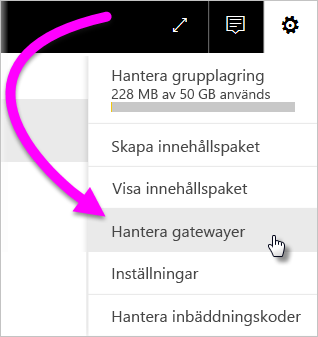
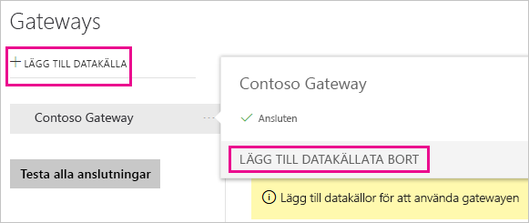
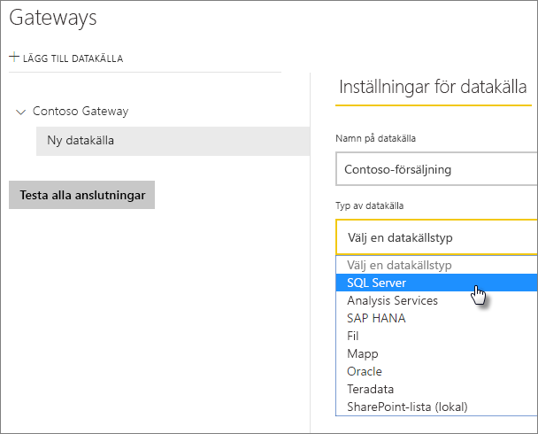
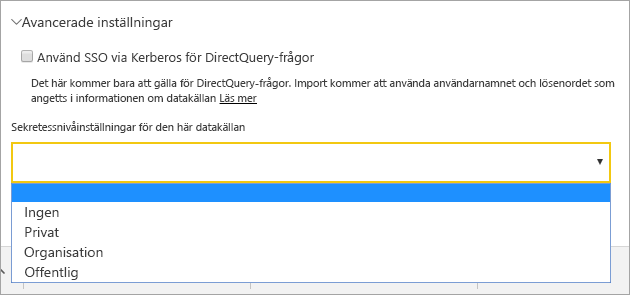
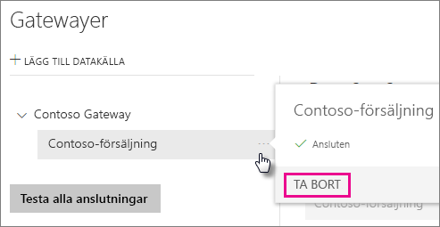
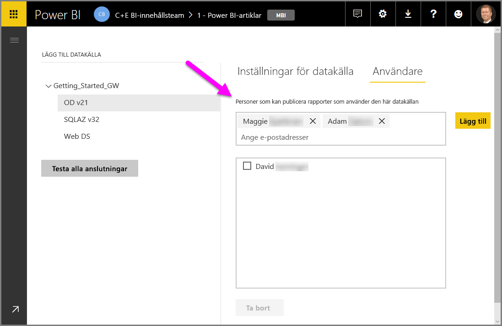
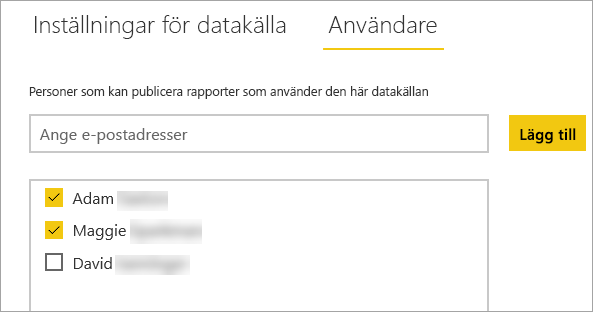
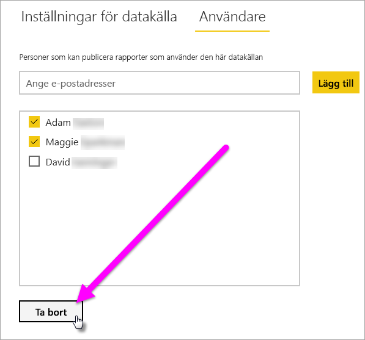

# Hantera datakällor

[!INCLUDE [gateway-rewrite](../includes/gateway-rewrite.md)]

Power BI stöder många [lokala datakällor](power-bi-data-sources.md) och var och en har sina egna krav. Gatewayer kan användas för en enstaka datakälla eller flera datakällor. I det här exemplet visar vi hur du lägger till SQL Server som en datakälla. Stegen är liknande för andra datakällor.

De flesta hanteringsåtgärder för datakällor kan även utföras med hjälp av API:er. Mer information finns i [REST-API:er (gatewayer)](/rest/api/power-bi/gateways).

## Lägga till en datakälla

1. Välj kugghjulsikonen  > **Hantera gatewayer** i det övre högra hörnet av Power BI-tjänsten.

    

2. Välj en gateway och välj sedan **Lägg till datakälla**. Eller gå till **Gatewayer** > **Lägg till datakälla**.

    

3. Välj **Typ av datakälla**.

    

4. Ange information för datakällan. I det här exemplet är det **Server**, **Databas** och annan information. 

    

5. För SQL Server väljer du en **Autentiseringsmetod** som är **Windows** eller **Grundläggande** (SQL-autentisering). Om du väljer **Grundläggande** ska du ange autentiseringsuppgifterna för datakällan.

6. Under **Avancerade inställningar** kan du konfigurera [Enkel inloggning (SSO)](service-gateway-sso-overview.md) för din datakälla. 

    

Du kan antingen ange **Använd SSO via Kerberos för DirectQuery-frågor** eller **Använd SSO via Kerberos för DirectQuery- och importfrågor** för DirectQuery-baserade rapporter och **Använd SSO via Kerberos för DirectQuery- och importfrågor** för uppdateringsbaserade rapporter.

Om du använder **Använd SSO via Kerberos för DirectQuery-frågor** och du använder den här datakällan för en DirectQuery-baserad rapport så används användaren som är mappad till den (Azure) Active Directory-användare som loggar in i Power BI-tjänsten. För uppdateringsbaserade rapporter används de autentiseringsuppgifter du anger i fälten **Användarnamn** och **Lösenord**.

Om du använder **Använd SSO via Kerberos för DirectQuery- och importfrågor** behöver du inte ange några autentiseringsuppgifter. Om den här datakällan används för en DirectQuery-baserad rapport så används användaren som är mappad till den (Azure) Active Directory-användare som loggar in i Power BI-tjänsten.  För uppdateringsbaserade rapporter används säkerhetskontexten för datamängdens ägare

> [!NOTE]
>Enkel inloggning för importfrågor är bara tillgängligt för listan med SSO-datakällor som använder [Kerberos-begränsad delegering](service-gateway-sso-kerberos.md).

7. Under **Avancerade inställningar** kan du som alternativ konfigurera [sekretessnivån](https://support.office.com/article/Privacy-levels-Power-Query-CC3EDE4D-359E-4B28-BC72-9BEE7900B540) för datakällan (gäller inte för [DirectQuery](desktop-directquery-about.md)).

    

8. Välj **Lägg till**. Du ser *Anslutningen lyckades* om processen lyckas.

    

Du kan nu använda den här datakällan för att ta med data från SQL Server i Power BI-instrumentpaneler och rapporter.

## Ta bort en datakälla

Du kan ta bort en datakälla om du inte längre använder den. Om du tar bort en datakälla bryts alla anslutningar till instrumentpaneler och rapporter som förlitar sig på den datakällan.

Du tar bort en datakälla genom att gå till datakällan och sedan välja **Ta bort**.

## Använda datakällan för schemalagd uppdatering eller DirectQuery

När du har skapat datakällan går den att använda med DirectQuery eller med schemalagd uppdatering.

> [!NOTE]
>Server- och databasnamnen måste överensstämma mellan Power BI Desktop och datakällan i den lokala datagatewayen.

Länken mellan din datamängd och datakällan i gatewayen är baserad på servernamnet och databasnamnet. Dessa namn måste matcha. Om du exempelvis anger en IP-adress för servernamnet i Power BI Desktop måste du använda den IP-adressen för datakällan i gatewaykonfigurationen. Om du använder *SERVER\INSTANS* i Power BI Desktop, måste du använda samma i den datakälla som konfigureras för gatewayen.

Om du finns med på fliken **Användare** för den datakälla som konfigurerats i gatewayen, och om server- och databasnamnen matchar, visas gatewayen som ett alternativ för användning med schemalagd uppdatering.

> [!WARNING]
> Om datamängden innehåller flera datakällor måste du lägga varje datakälla i gatewayen. Om en eller flera datakällor inte har lagts till i gatewayen visas inte gatewayen som tillgänglig för schemalagd uppdatering.

### Begränsningar

OAuth är ett schema för autentiseringsmetoder som stöds endast för anpassade anslutningar med den lokala datagatewayen. Du kan inte lägga till andra datakällor som kräver OAuth. Om datamängden har en datakälla som kräver OAuth, och datakällan inte är ett anpassat anslutningsprogram, kan du inte använda gatewayen för schemalagd uppdatering.

## Hantera användare

När du har lagt till en datakälla till en gateway ger du användarna och de e-postaktiverade säkerhetsgrupperna åtkomst till den specifika datakällan (inte hela gatewayen). Datakällans användarlista styr endast vem som får publicera rapporter som innehåller data från datakällan. Rapportägare kan skapa instrumentpaneler, innehållspaket och appar och dela dem med andra användare.

Du kan även ge användare och säkerhetsgrupper administrativ åtkomst till gatewayen.

### Lägga till användare till en datakälla

1. Välj kugghjulsikonen  > **Hantera gatewayer** i det övre högra hörnet av Power BI-tjänsten.

2. Välj den datakälla där du vill lägga till användare.

3. Välj **Användare** och ange en användare från organisationen som du vill bevilja åtkomst till den valda datakällan. Till exempel ser du på följande skärm att du lägger till Maggie och Adam.

    

4. Välj **Lägg till** så visas den tillagda medlemmens namn i rutan.

    

Kom ihåg att du behöver lägga till användare i varje datakälla som du vill bevilja åtkomst till. Varje datakälla har en separat lista över användare. Lägg till användare i varje datakälla separat.

### Ta bort användare från en datakälla

På datakällans flik **Användare** kan du ta bort användare och säkerhetsgrupper som använder den här datakällan.

## Lagra krypterade autentiseringsuppgifter i molnet

När du lägger till en datakälla till gatewayen, måste du ange autentiseringsuppgifter för datakällan. Alla frågor till datakällan kommer att köras med dessa autentiseringsuppgifter. Autentiseringsuppgifterna krypteras på ett säkert sätt. Innan de lagras i molnet krypteras de med hjälp av symmetrisk kryptering, så att de inte kan dekrypteras i molnet. Autentiseringsuppgifterna skickas till den dator som kör gatewayen, lokalt, där de dekrypteras när datakällorna används.

## Lista över tillgängliga typer av datakällor

Information om vilka datakällor som stöds av den lokala datagatewayen finns i [Power BI-datakällor](power-bi-data-sources.md).

## Nästa steg

* [Hantera din datakälla – Analysis Services](service-gateway-enterprise-manage-ssas.md)
* [Hantera din datakälla – SAP HANA](service-gateway-enterprise-manage-sap.md)
* [Hantera din datakälla – SQL Server](service-gateway-enterprise-manage-sql.md)
* [Hantera din datakälla – Oracle](service-gateway-onprem-manage-oracle.md)
* [Hantera din datakälla – Import/schemalagd uppdatering](service-gateway-enterprise-manage-scheduled-refresh.md)
* [Vägledning för distribution av en datagateway](service-gateway-deployment-guidance.md)

Fler frågor? Testa [Power BI Community](https://community.powerbi.com/).
