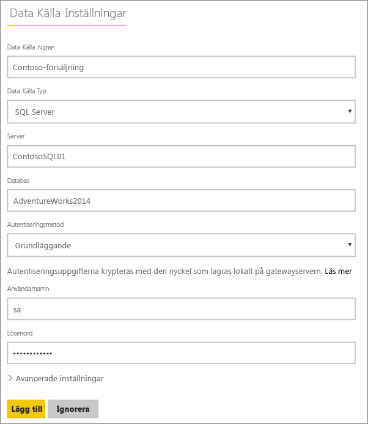
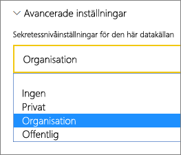
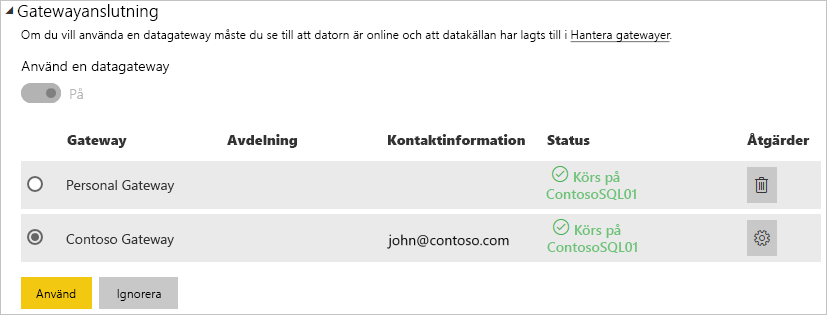

# Hantera din datakälla – SQL Server

[!INCLUDE [gateway-rewrite](../includes/gateway-rewrite.md)]

När du har [installerat den lokala datagatewayen](/data-integration/gateway/service-gateway-install) kan du [lägga till datakällor](service-gateway-data-sources.md#add-a-data-source) som kan användas med gatewayen. Den här artikeln handlar om hur du kan arbeta med gatewayer och SQL Server-datakällor som används för antingen schemalagd uppdatering eller DirectQuery.

## Lägga till en datakälla

Mer information om hur du lägger till en datakälla finns i [Lägga till en datakälla](service-gateway-data-sources.md#add-a-data-source). Välj **SQL Server** under **Typ av datakälla**.

> [!NOTE]
> När du använder DirectQuery har gatewayen endast stöd för **SQL Server 2012 SP1** och senare versioner.

Fyll sedan i informationen för datakällan, vilket innefattar **Server** och **Databas**. 

Välj antingen **Windows** eller **Grundläggande** under **Autentiseringsmetod**. Välj **Grundläggande** om du planerar att använda SQL-autentisering i stället för Windows-autentisering. Ange sedan de autentiseringsuppgifter som ska användas för datakällan.

> [!NOTE]
> Alla frågor till datakällan kommer att köras med autentiseringsuppgifterna, såvida inte enkel inloggning (SSO) med Kerberos har konfigurerats och aktiverats för datakällan. Med enkel inloggning använder import av datamängder de lagrade autentiseringsuppgifterna, men DirectQuery-datamängder använder den aktuella Power BI-användaren för att köra frågorna med hjälp av enkel inloggning. Mer information om hur autentiseringsuppgifter lagras finns i [Lagra krypterade autentiseringsuppgifter i molnet](service-gateway-data-sources.md#store-encrypted-credentials-in-the-cloud). Eller se artikeln med beskrivningen av att [använda Kerberos för enkel inloggning (SSO) från Power BI till lokala datakällor](service-gateway-sso-kerberos.md).

När du har fyllt i allt väljer du **Lägg till**. Nu kan du använda den här datakällan för schemalagd uppdatering, eller DirectQuery mot en lokal SQL Server. *Anslutningen lyckades* visas om anslutningen lyckades.

### Avancerade inställningar

Om du vill kan du konfigurera sekretessnivån för datakällan. Den här inställningen styr hur data kan kombineras. Den används endast vid schemalagd uppdatering. Sekretessnivåinställningen gäller inte för DirectQuery. Mer information om sekretessnivåer för datakälla finns i [Sekretessnivåer (Power Query)](https://support.office.com/article/Privacy-levels-Power-Query-CC3EDE4D-359E-4B28-BC72-9BEE7900B540).

## Använda datakällan

När du har skapat datakällan går den att använda med DirectQuery eller med schemalagd uppdatering.

> [!NOTE]
> Server- och databasnamnen måste överensstämma mellan Power BI Desktop och datakällan i den lokala datagatewayen.

Länken mellan din datauppsättning och datakällan i gatewayen är baserad på servernamnet och databasnamnet. Dessa namn måste matcha. Om du exempelvis anger en IP-adress för servernamnet i Power BI Desktop måste du använda den IP-adressen för datakällan i gatewaykonfigurationen. Om du använder *SERVER\INSTANS* i Power BI Desktop, måste du använda den i den datakälla som konfigureras för gatewayen.

Det här kravet gäller både DirectQuery och schemalagd uppdatering.

### Använda datakällan med DirectQuery-anslutningar

Se till att server- och databasnamnen överensstämmer mellan Power BI Desktop och den konfigurerade datakällan för gatewayen. Du behöver även kontrollera att användaren finns med på fliken **Användare** för datakällan för att DirectQuery-datamängder ska kunna publiceras. Valet för DirectQuery uppstår i Power BI Desktop när du importerar data första gången. Mer information om hur DirectQuery används finns i [Använda DirectQuery i Power BI Desktop](desktop-use-directquery.md).

När du har publicerat, antingen från Power BI Desktop eller **Hämta Data**, borde dina rapporter fungera. Det kan ta ett par minuter efter att du har skapat datakällan i gatewayen innan anslutningen kan användas.

### Använda datakällan med schemalagd uppdatering

Om du finns med på fliken **Användare** för den datakälla som konfigurerats i gatewayen, och om servernamnet och databasnamnet matchar, visas gatewayen som ett alternativ för användning med schemalagd uppdatering.

## Nästa steg

* [Ansluta till lokala data i SQL Server](service-gateway-sql-tutorial.md)
* [Felsökning av den lokala datagatewayen](/data-integration/gateway/service-gateway-tshoot)
* [Felsöka gatewayer – Power BI](service-gateway-onprem-tshoot.md)
* [Använda Kerberos för enkel inloggning (SSO) från Power BI till lokala datakällor](service-gateway-sso-kerberos.md)

Fler frågor? Fråga [Power BI Community](https://community.powerbi.com/).
