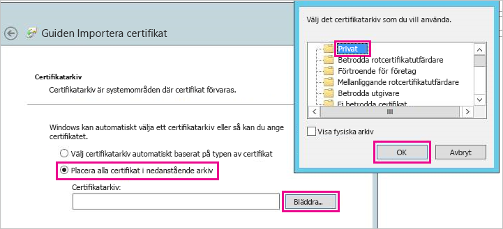
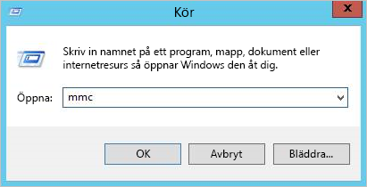

# <a name="use-security-assertion-markup-language-saml-for-sso-from-power-bi-to-on-premises-data-sources"></a>Använda Security Assertion Markup Language (SAML) för enkel inloggning från Power BI till lokala datakällor

När enkel inloggning aktiveras blir det enkelt för Power BI-rapporter och instrumentpaneler att uppdatera data från lokala källor samtidigt som behörigheter på användarnivå på dessa källor respekteras. Använd [Security Assertion Markup Language (SAML)](https://www.onelogin.com/pages/saml) för att aktivera sömlös anslutning för enkel inloggning. 

## <a name="supported-data-sources"></a>Datakällor som stöds

Vi stöder för närvarande SAP HANA med SAML. Mer information om att installera och konfigurera enkel inloggning för SAP HANA med hjälp av SAML finns i [SAML SSO för BI-plattform till HANA](https://wiki.scn.sap.com/wiki/display/SAPHANA/SAML+SSO+for+BI+Platform+to+HANA).

Vi har stöd för ytterligare datakällor med [Kerberos](service-gateway-sso-kerberos.md) (inklusive SAP HANA).

För SAP HANA bör du aktivera kryptering innan du upprättar en SAML SSO-anslutning. Om du vill aktivera kryptering konfigurerar du HANA-servern så att den accepterar krypterade anslutningar och konfigurerar gatewayen så att kommunikationen med HANA-servern krypteras. Eftersom HANA ODBC-drivrutinen inte krypterar SAML-försäkran som standard så skickas den signerade SAML-försäkran från gatewayen till HANA-servern *okrypterat*, och riskerar då att avlyssnas och återanvändas av tredje part. Instruktioner för att aktivera kryptering för HANA med hjälp av OpenSSL-biblioteket finns i [Aktivera kryptering för SAP HANA](/power-bi/desktop-sap-hana-encryption).

## <a name="configuring-the-gateway-and-data-source"></a>Konfigurera gatewayen och datakällan

För att använda SAML måste du etablera en förtroenderelation mellan de HANA-servrar du vill aktivera SSO för och gatewayen. I det här scenariot fungerar gatewayen som SAML Identity Provider (IdP). Det finns olika sätt att etablera den här relationen. Ett sätt är att importera X509-certifikatet för gateway-IdP:n till HANA-servrarnas förtroendelager. Ett annat sätt är att låta gatewayens X509-certifikat signeras av en rotcertifikatutfärdare (CA) som är betrodd av HANA-servrarna. Vi beskriver den senare metoden i den här guiden, men du kan använda en annan metod om det är enklare.

I den här guiden används OpenSSL används som kryptografiprovider för HANA-servern, men SAP rekommenderar att du använder det kryptografiska SAP-biblioteket (kallas även CommonCryptoLib eller sapcrypto) i stället för OpenSSL i de avslutande stegen där vi etablerar förtroenderelationen. Mer information finns i den officiella SAP-dokumentationen.

Följande steg beskriver hur du etablerar en förtroenderelation mellan en HANA-server och gatewayens IdP genom att registrera gateway-IdP:ns X509-certifikat med hjälp av en rotcertifikatutfärdare som är betrodd av HANA-servern. Du skapar denna rotcertifikatutfärdare:

1. Skapa rotcertifikatutfärdarens X509-certifikat och den privata nyckeln. Om du till exempel vill skapa rotcertifikatutfärdarens X509-certifikat och den privata nyckeln i .pem-format anger du följande kommando:

   ```
   openssl req -new -x509 -newkey rsa:2048 -days 3650 -sha256 -keyout CA_Key.pem -out CA_Cert.pem -extensions v3_ca
   ```

    Se till att rotcertifikatutfärdarens privata nyckel är ordentligt skyddad. Om tredje part får tag på den så kan den användas för obehörig åtkomst till HANA-servern. 

 1. Lägg till certifikatet (till exempel CA_Cert.pem) i HANA-serverns förtroendelager så att HANA-servern litar på alla certifikat som signeras av den rotcertifikatutfärdare du nyss skapade. 

    Du hittar HANA-serverns förtroendelager genom att granska konfigurationsinställningen **ssltruststore**. Om du har följt instruktionerna i SAP-dokumentationen som beskriver hur du konfigurerar OpenSSL kanske HANA-servern redan litar på en rotcertifikatutfärdare som du kan återanvända. Mer information finns i artikeln [How to Configure Open SSL for SAP HANA Studio to SAP HANA Server](https://archive.sap.com/documents/docs/DOC-39571) (Så konfigurerar du Open SSL för SAP HANA Studio till SAP HANA-server). Om du har flera HANA-servrar som du vill aktivera SAML SSO för kan du kontrollera att alla servrar litar på den här rotcertifikatutfärdaren.

1. Skapa X509-certifikat för gatewayens IdP. 

   Om du till exempel vill skapa en begäran för signering av certifikat (IdP_Req.pem) och en privat nyckel (IdP_Key.pem) som är giltiga under ett år kör du följande kommando:

   ```
   openssl req -newkey rsa:2048 -days 365 -sha256 -keyout IdP_Key.pem -out IdP_Req.pem -nodes
   ```

 1. Signera begäran för certifikatsignering med hjälp av rotcertifikatutfärdaren som du har konfigurerat att dina HANA-servrar ska lita på. 

    Om du till exempel vill registrera IdP_Req.pem med CA_Cert.pem och CA_Key.pem (certifikatet och nyckeln för rotcertifikatutfärdaren) kör du följande kommando:

    ```
    openssl x509 -req -days 365 -in IdP_Req.pem -sha256 -extensions usr_cert -CA CA_Cert.pem -CAkey CA_Key.pem -CAcreateserial -out IdP_Cert.pem
    ```

     IdP-certifikatet gäller sedan i ett år (se alternativet -days). 

Importera IdP:ns certifikat till HANA Studio för att skapa en ny SAML-identitetsprovider:

1. I SAP HANA Studio högerklickar du på din SAP HANA-server och går till **Security** (Säkerhet) &gt; **Open Security Console** (Öppna säkerhetskonsolen) &gt; **SAML Identity Provider** (SAML-identitetsprovider) &gt; **OpenSSL Cryptographic Library** (Kryptografiskt bibliotek för OpenSSL).

    

1. Välj **Importera**, gå till IdP_Cert.pem och importera den.

1. I SAP HANA Studio väljer du mappen **Säkerhet**.

    

1. Expandera **Användare** och välj sedan den användare du vill mappa Power BI-användaren till.

1. Välj **SAML** och sedan **Konfigurera**.

    

1. Välj den identitetsprovider som du skapade i steg 2. För **Extern identitet** anger du Power BI-användarens UPN (vanligtvis den e-postadress som användaren loggar in i Power BI med) och väljer sedan **Lägg till**. Om du har konfigurerat din gateway att använda konfigurationsalternativet *ADUserNameReplacementProperty* ska du ange värdet som ska ersätta Power BI-användarens ursprungliga UPN. 

   Om du till exempel ställer in *ADUserNameReplacementProperty* på **SAMAccountName** bör du ange användarens **SAMAccountName**.

    

Nu när du har konfigurerat gatewayens certifikat och identitet konverterar du certifikatet till pfx-format och konfigurerar gatewayen till att använda certifikatet:

1. Konvertera certifikatet till pfx-format genom att köra följande kommando. Observera att det här kommandot namnger den resulterande .pfx-filen som samlcert.pfx och anger *root* som filens lösenord:

    ```
    openssl pkcs12 -export -out samltest.pfx -in IdP_Cert.pem -inkey IdP_Key.pem -passin pass:root -passout pass:root
    ```

1. Kopiera pfx-filen till gatewaydatorn:

    1. Dubbelklicka på samltest.pfx och välj sedan **Lokal dator** &gt; **Nästa**.

    1. Ange lösenordet och välj sedan **Nästa**.

    1. Välj **Placera alla certifikat i nedanstående arkiv** och sedan **Bläddra** &gt; **Personligt** &gt; **OK**.

    1. Välj **Nästa** och sedan **Slutför**.

       

1. Bevilja gatewaytjänstkontot åtkomst till den privata nyckeln för certifikatet:

    1. På gatewaydatorn kör du Microsoft Management Console (MMC).

        

    1. Under **Arkiv** väljer du **Lägg till/ta bort snapin-modul**.

        

    1. Välj **Certifikat** &gt; **Lägg till** och sedan **Datorkonto** &gt; **Nästa**.

    1. Välj **Lokal dator** &gt; **Slutför** &gt; **OK**.

    1. Expandera **Certifikat** &gt; **Personligt** &gt; **Certifikat** och leta upp certifikatet.

    1. Högerklicka på certifikatet och gå till **Alla uppgifter** &gt; **Hantera privata nycklar**.

        

    1. Lägg till gatewaytjänstkontot till listan. Som standard är kontot **NT SERVICE\PBIEgwService**. Du kan ta reda på vilket konto som kör gatewaytjänsten genom att köra **services.msc** och leta upp **Tjänst för lokal datagateway**.

        

Slutligen följer du de här stegen för att lägga till certifikatets tumavtryck i gatewaykonfigurationen:

1. Kör följande PowerShell-kommando för att visa certifikaten i datorn:

    ```powershell
    Get-ChildItem -path cert:\LocalMachine\My
    ```

1. Kopiera tumavtrycket för det certifikat som du skapade.

1. Gå till gatewaykatalogen. Som standard är den C:\Program Files\On-premises data gateway.

1. Öppna PowerBI.DataMovement.Pipeline.GatewayCore.dll.config och leta upp avsnittet *SapHanaSAMLCertThumbprint*. Klistra in det tumavtryck du kopierade.

1. Starta om gatewaytjänsten.

## <a name="running-a-power-bi-report"></a>Köra en Power BI-rapport

Nu kan du använda sidan **Hantera gateway** i Power BI till att konfigurera SAP HANA-datakällan. Aktivera SSO via SAML under **Avancerade inställningar**. Då kan du publicera rapporter och datamängder med bindning till den aktuella datakällan.

   

## <a name="troubleshooting"></a>Felsökning

När du har konfigurerat SAML-baserad enkel inloggning kan du se följande felmeddelande i Power BI-portalen: *De tillhandahållna autentiseringsuppgifterna kan inte användas för SapHana-källan.* Det här felet indikerar att SAML-autentiseringsuppgifterna avvisades av SAP HANA.

Autentiseringsspårning på serversidan ger detaljerad information för felsökning av problem med autentisering på SAP HANA. Följ de här stegen för att konfigurera spårning för din SAP HANA-server:

1. Aktivera autentiseringsspårning genom att köra följande fråga på SAP HANA-servern:

    ```
    ALTER SYSTEM ALTER CONFIGURATION ('indexserver.ini', 'SYSTEM') set ('trace', 'authentication') = 'debug' with reconfigure 
    ```

1. Återskapa problemet.

1. Öppna administrationskonsolen i HANA Studio och välj fliken **Diagnosis Files** (Diagnostikfiler).

1. Öppna den senaste spårningen av indexservern och sök efter *SAMLAuthenticator.cpp*.

    Du bör hitta ett detaljerat felmeddelande som anger rotorsaken, här är ett exempel:

    ```
    [3957]{-1}[-1/-1] 2018-09-11 21:40:23.815797 d Authentication   SAMLAuthenticator.cpp(00091) : Element '{urn:oasis:names:tc:SAML:2.0:assertion}Assertion', attribute 'ID': '123123123123123' is not a valid value of the atomic type 'xs:ID'.
    [3957]{-1}[-1/-1] 2018-09-11 21:40:23.815914 i Authentication   SAMLAuthenticator.cpp(00403) : No valid SAML Assertion or SAML Protocol detected
    ```

1. När du har slutfört felsökningen kan du stänga av autentiseringsspårningen genom att köra följande fråga:

    ```
    ALTER SYSTEM ALTER CONFIGURATION ('indexserver.ini', 'SYSTEM') UNSET ('trace', 'authentication');
    ```

## <a name="next-steps"></a>Nästa steg

Du kan läsa mer om den lokala datagatewayen och DirectQuery i de här resurserna:

* [Vad är en lokal datagateway?](/data-integration/gateway/service-gateway-onprem)
* [DirectQuery i Power BI](desktop-directquery-about.md)
* [Datakällor som stöds av DirectQuery](power-bi-data-sources.md)
* [DirectQuery och SAP BW](desktop-directquery-sap-bw.md)
* [DirectQuery och SAP HANA](desktop-directquery-sap-hana.md)
