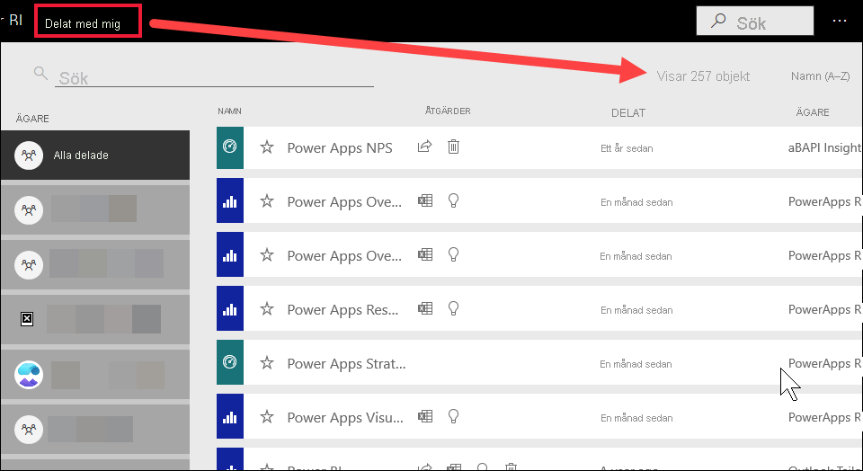

# Navigering för Power BI konsumenter: global sökning

[!INCLUDE[consumer-appliesto-yyny](../includes/consumer-appliesto-yyny.md)]

[!INCLUDE [power-bi-service-new-look-include](../includes/power-bi-service-new-look-include.md)]

När du börjar använda Power BI-tjänsten så är bara några få innehållskomponenter tillgängliga (instrumentpaneler, rapporter, appar). Men allteftersom dina kollegor börjar dela innehåll med dig och du börjar hämta appar så kan du få långa listor med innehåll. Det är då du inser att sökning och sortering är mycket användbart.

## Söka efter innehåll
 Sökning är tillgängligt från nästan alla delar av Power BI-tjänsten. Det är bara att titta efter sökrutan eller sökikonen .

 Skriv hela eller delar av namnet på en instrumentpanel, rapport, arbetsbok, arbetsyta, app eller ägare i sökfältet. Power BI söker igenom allt innehåll. 

  

 I vissa områden av Power BI, t.ex. arbetsytor, finns det två olika sökfält. Sökfältet på menyraden söker igenom allt innehåll medan sökfältet arbetsytans sökfält endast söker igenom arbetsytan.

  

## Sortera innehållslistor

Om du bara har några få innehållsbitar, så är kanske inte sortering nödvändigt.  Men när du har långa listor med instrumentpaneler och rapporter, så kan sortering hjälpa dig att hitta det du söker. Den här innehållslistan för **Delas med mig** innehåller t.ex. 257 objekt. 

Just nu sorteras innehållslistan alfabetiskt efter namn, från A till Ö. Om du vill ändra sorteringsvillkoren väljer du pilen till höger om **Namn (A-Ö)** .

Sortering är också tillgängligt på arbetsytor. I det här exemplet sorteras innehållet efter det datum då det **uppdaterades**. Om du vill ange sorteringsvillkor för arbetsytor, så välj kolumnrubriker. Markera en gång för att välja rubriken och markera en gång till för att ändra sorteringsriktningen. 

Det finns vissa kolumner som inte kan sorteras. Hovra över kolumnrubrikerna för att identifiera vilka som kan sorteras.

## Överväganden och felsökning
* För datauppsättningar är **Sortera efter** inte tillgängligt per ägare.

## Nästa steg
[Sortera visuella objekt i rapporter](end-user-change-sort.md)

[Sortera data i visuella objekt](end-user-change-sort.md)

Har du fler frågor? [Prova Power BI Community](https://community.powerbi.com/)
