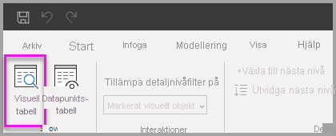
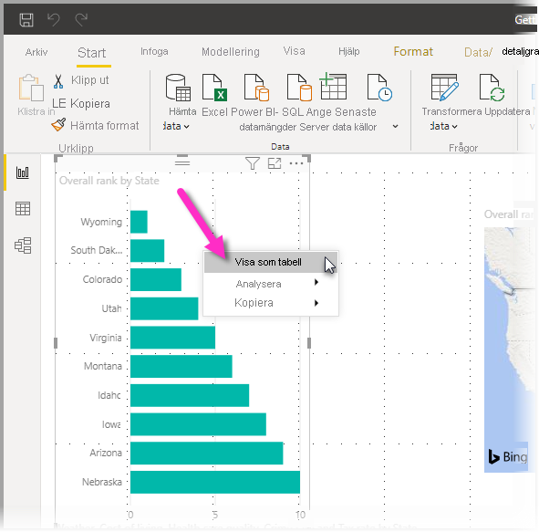
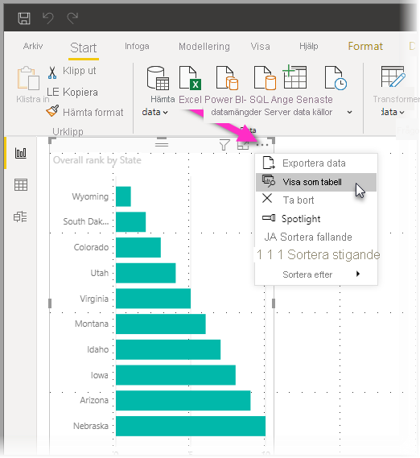

# Använda visuell tabell och datapunkttabell i Power BI Desktop
I **Power BI Desktop** kan du visa detaljer om en visualisering och se textrepresentationer av underliggande data eller enskilda dataelement för den valda visualiseringen. De här funktionerna kallas ibland för *klicka igenom*, *detaljerad information* eller *gå in på detaljnivå*.

Du kan använda en **visuell tabell** för att visa data i ett visuellt objekt som en tabell eller använda en **datapunkttabell** för att visa en tabell över de data som används för att beräkna en enskild datapunkt. 

>[!IMPORTANT]
>**Visuell tabell** och **datapunkttabell** har endast stöd för följande visualiseringstyper:
>  - Stapeldiagram
>  - Kolumndiagram
>  - Ringdiagram
>  - Ifylld karta
>  - Tratt
>  - Karta
>  - Cirkeldiagram
>  - Trädkarta

## Använda Visuell tabell i Power BI Desktop

**Visuell tabell** visar de data som ligger under en visualisering. **Visuell tabell** visas på fliken **Data/detaljgranska** i avsnittet **Visa** i menyfliksområdet när ett visuellt objekt väljs.

Du kan också visa data genom att högerklicka på en visualisering och sedan välja **Visa data** från menyn som visas, eller genom att välja **Fler alternativ** (...) uppe till höger i en visualisering och sedan **Visa som tabell**.

&nbsp;&nbsp;

> [!NOTE]
> Du måste hovra över en datapunkt i visualiseringen för att snabbmenyn ska vara tillgänglig.

När du väljer **Visuell tabell** eller **Datapunkttabell**, visar Power BI Desktop-arbetsytan både en visuell och en textrepresentation av dina data. I *vågrät vy* visas visualiseringen på den övre delen av arbetsytan och data visas på den nedre halvan. 

Du kan växla mellan vågrät vy och *lodrät vy* genom att välja ikonen i det övre högra hörnet av arbetsytan.

Gå tillbaka till rapporten genom att markera **< Tillbaka till rapporten** i det övre vänstra hörnet på arbetsytan.

## Använda Datapunkttabell i Power BI Desktop

Du kan också fokusera på en datapost i en visualisering och gå in på detaljnivå på bakomliggande data. För att använda en **datapunkttabell** väljer du en visualisering och sedan **Datapunkttabell** på fliken **Data/detaljgranska** i avsnittet **Visuella verktyg** i menyfliksområdet och sedan en datapunkt eller rad i visualiseringen. 

> [!NOTE]
> Om knappen **Datapunkttabell** i menyfliksområdet är inaktiverad och nedtonad, betyder det att den valda visualiseringen inte har stöd för funktionen **Datapunkttabell**.

Du kan också högerklicka på ett dataelement och välja **Datapunkttabell** från menyn som visas.

När du väljer **Datapunkttabell** för ett dataelement, visar Power BI Desktop-arbetsytan alla data som är associerade med det valda elementet. 

Gå tillbaka till rapporten genom att markera **< Tillbaka till rapporten** i det övre vänstra hörnet på arbetsytan.

> [!NOTE]
>**Datapunkttabell** har följande begränsningar:
> - Du kan inte ändra data i vyn **Datapunkttabell** och sedan spara dem i rapporten igen.
> - Du kan inte använda **Datapunkttabell** när ditt visuella objekt använder ett beräknat mått.
> - Du kan inte använda **Datapunkttabell** när du är ansluten till en flerdimensionell livemodell.

## Nästa steg
Det finns en massa sorters rapportformatering och funktioner för datahantering i **Power BI Desktop**. Kolla in följande resurser för några exempel:

* [Använd gruppering och diskretisering i Power BI Desktop](desktop-grouping-and-binning.md)
* [Använd stödlinjer, fäst till rutnät, z-ordning, justering och distribution i Power BI Desktop-rapporter](desktop-gridlines-snap-to-grid.md)

