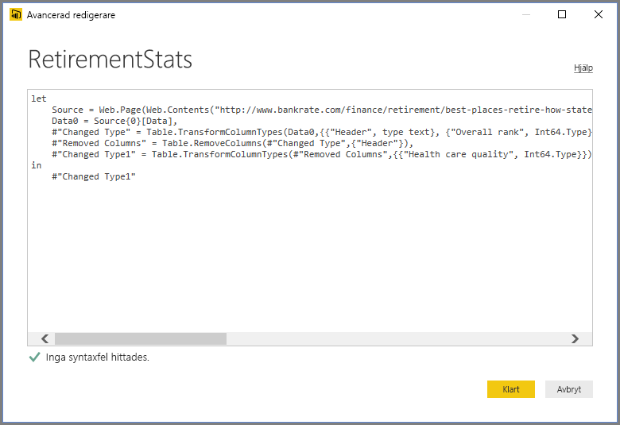
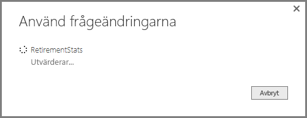

# Frågeöversikt i Power BI Desktop
Med Power BI Desktop kan du ansluta till en värld av data, skapa övertygande och grundläggande rapporter och dela ditt arbete med andra – som sedan kan utgå från ditt arbete och förbättra sina Business Intelligence-uppgifter.

Power BI Desktop har tre vyer:

* **Rapportvy** – Här kan du använda frågor för att skapa tilltalande visualiseringar, ordna dem som du vill att de ska visas, använda flera sidor och dela dem med andra
* **Datavy** – Se data i rapporten i datamodellformat, där du kan lägga till mått, skapa nya kolumner och hantera relationer
* **Relationsvy** – Få en grafisk visning av de relationer som har upprättats i datamodellen och hantera eller ändra dem efter behov.

Gå till de här vyerna genom att välja någon av tre ikonerna längs vänster sida i Power BI Desktop. I följande bild är vyn **Rapport** vald, vilket visas med ett gult band intill ikonen.  

 
I Power BI Desktop medföljer även Power Query-redigeraren. Använd Power Query-redigeraren för att ansluta till en eller flera datakällor, forma och transformera data efter dina behov och sedan läsa in modellen i Power BI Desktop.

Det här dokumentet innehåller en översikt av arbetet med data i Power Query-redigeraren, men det finns mer som du kan lära dig. I slutet av det här dokumentet finns länkar till detaljerad vägledning om de datatyper som stöds. Det finns även vägledning om hur du ansluter till data, formar data, skapar relationer och kommer igång.

Men först ska vi bekanta oss med Power Query-redigeraren.

## Power Query Editor
Gå till Power Query-redigeraren genom att välja **Redigera frågor** på fliken **Start** i Power BI Desktop.  

Utan dataanslutningar visas Power Query-redigeraren som ett tomt fönster som är redo för data.  

När en fråga har lästs in blir vyn för Power Query-redigeraren mer intressant. Om vi ansluter till följande webbdatakälla läser Power Query-redigeraren in information om data, som du sedan kan börja forma:

[*https://www.bankrate.com/retirement/best-and-worst-states-for-retirement/*](https://www.bankrate.com/retirement/best-and-worst-states-for-retirement/)

Så här ser Power Query-redigeraren ut när du har upprättat en dataanslutning:

1. Många knappar i menyfliksområdet är nu aktiverade, så att du kan interagera med data i frågan.
2. I det vänstra fönstret visas frågorna och där kan du välja, visa och forma dem.
3. I mittenfönstret visas data från den valda frågan och kan formas.
4. En lista med frågans egenskaper och tillämpade steg visas i fönstret **Frågeinställningar**.  
   
   

Vi ska gå igenom de här fyra områdena: menyfliksområdet, fönstret Frågor, vyn Data och fönstret Frågeinställningar.

## Menyfliksområdet för frågor
Menyfliksområdet i Power Query-redigeraren består av fyra flikar: **Start**, **Transformera**, **Lägg till kolumn** och **Visa**.

Fliken **Start** innehåller vanliga frågeuppgifter.

Om du vill ansluta till data och börja skapa frågan väljer du **Ny källa**. En meny visas med de vanligaste datakällorna.  

Mer information om tillgängliga datakällor finns i **Datakällor**. Information om hur du ansluter till data, inklusive exempel och anvisningar finns i **Anslut till data**.

Fliken **Transformera** ger tillgång till vanliga uppgifter för datatransformering, till exempel:

* Lägga till eller ta bort kolumner
* Ändra datatyper 
* Dela kolumner 
* Andra datadrivna uppgifter

Mer information om datatransformering, inklusive exempel, finns i [Självstudie: Forma och kombinera data i Power BI Desktop](https://docs.microsoft.com/power-bi/desktop-shape-and-combine-data).

Fliken **Lägg till kolumn** innehåller ytterligare uppgifter som är associerade med att lägga till en kolumn, formatera kolumndata och lägga till anpassade kolumner. Följande bild visar fliken **Lägg till kolumn**.  

Fliken **Visa** i menyfliksområdet används för att växla mellan olika fönster. Den används också till att visa Avancerad redigerare. Följande bild visar fliken **Visa**.  

Det kan vara bra att veta att många av uppgifterna som är tillgängliga från menyfliksområdet, också är tillgängliga om du högerklickar på en kolumn eller andra data i det mittersta fönstret.

## Det vänstra fönstret (Frågor)
I det vänstra fönstret, **Frågor**, visas antalet aktiva frågor samt namnet på frågan. När du väljer en fråga i det vänstra fönstret visas datan i det mittersta fönstret. Där kan du utforma och transformera datan efter dina behov. I följande bild visas det vänstra fönstret med en fråga.  

## Fönstret i mitten (Data)
I mittenfönstret **Data** visas data från den valda frågan. I det här fönstret utförs mycket av arbetet i vyn **Fråga**.

I följande bild visas den webbdataanslutning som upprättades tidigare. Kolumnen **Produkt** är markerad och dess rubrik högerklickas så att tillgängliga menyalternativ visas. Observera att många av de menyobjekt som visas när man högerklickar är samma som knapparna på flikarna i menyfliksområdet.  

När du väljer ett alternativ i högerklicksmenyn (eller en knapp i menyfliksområdet) tillämpar frågan steget på data. Den sparar även steget som en del av själva frågan. Stegen som utförs registreras i fönstret **Frågeinställningar** i ordningsföljd, vilket beskrivs i nästa avsnitt.  

## Det högra fönstret (Frågeinställningar)
I det högra fönstret, **Frågeinställningar**, visas alla steg som är associerade med en fråga. I följande bild återspeglar exempelvis avsnittet **Använda steg** i fönstret **Frågeinställningar** det faktum att vi just ändrade typ för kolumnen **Övergripande poäng**.

När ytterligare formningssteg tillämpas på frågan registreras de i avsnittet **Tillämpade steg**.

Det är viktigt att känna till att underliggande data *inte* ändras. I stället justerar och formar Power Query-redigeraren sin vy av data. Den formar och justerar även vyn över eventuella interaktioner med underliggande data som sker baserat på hur Power Query-redigeraren formar och ändrar vyn över dessa data.

I fönstret **Frågeinställningar** kan du byta namn på steg, ta bort steg eller ordna om stegen som du vill. Detta gör du genom att högerklicka på steget i avsnittet **Använda steg** och välja i menyn som visas. Alla åtgärder för frågan utförs i den ordning de visas i fönstret **Använda steg**.

## Avancerad redigerare
I **Avancerad redigerare** kan du se den kod som Power Query-redigeraren skapar med varje steg. Där kan du även skapa din egen formningskod. Starta redigeraren genom att välja **Visa** i menyfliksområdet och sedan **Avancerad redigerare**. Ett fönster visas med den befintliga frågekoden.  

Du kan redigera koden direkt i fönstret **Avancerad redigerare**. Stäng fönstret genom att välja **Klar** eller **Avbryt**.  

## Spara ditt arbete
När frågan är som den ska vara väljer du **Stäng och tillämpa** från menyn **Arkiv** i Power Query-redigeraren. Den här åtgärden tillämpar ändringarna och stänger redigeraren.  

Power BI Desktop visar en dialogruta med sin status.  

När du är klar kan Power BI Desktop spara arbetet i form av en *.pbix*-fil.

Spara arbetet genom att välja **Arkiv** \> **Spara** (eller **Arkiv** \> **Spara som**) enligt följande bild.  

## Nästa steg
Det finns olika typer av saker som du kan göra med Power BI Desktop. Läs följande resurser för mer information om dess möjligheter:

* [Vad är Power BI Desktop?](../fundamentals/desktop-what-is-desktop.md)
* [Datakällor i Power BI Desktop](../connect-data/desktop-data-sources.md)
* [Ansluta till data i Power BI Desktop](../connect-data/desktop-connect-to-data.md)
* [Självstudie: Forma och kombinera data i Power BI Desktop](../connect-data/desktop-shape-and-combine-data.md)
* [Utföra vanliga frågeuppgifter i Power BI Desktop](desktop-common-query-tasks.md)   
