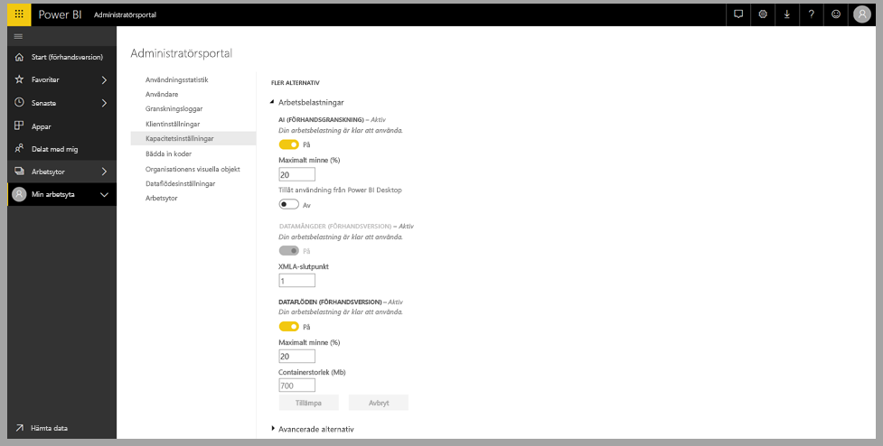
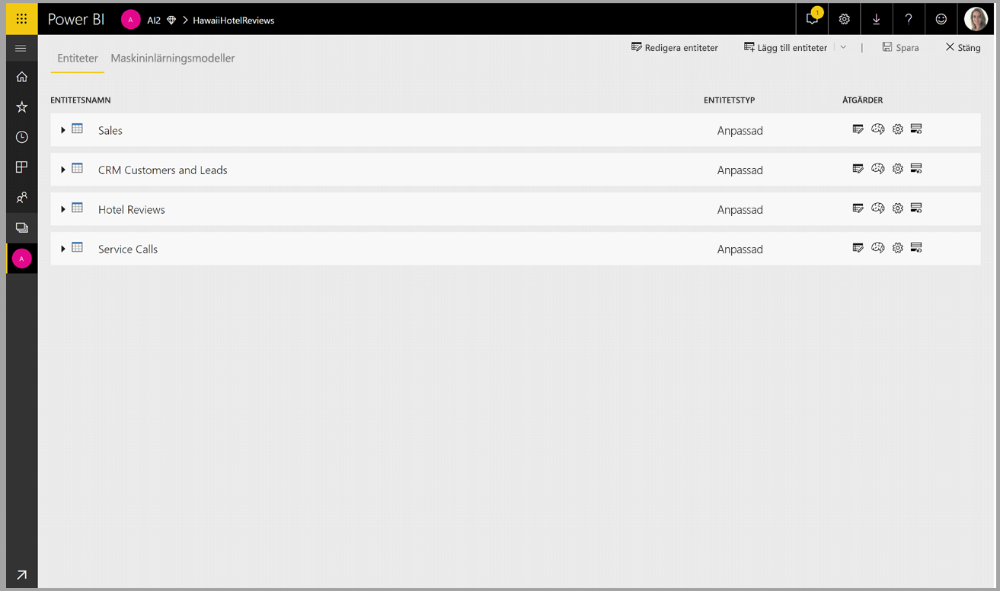
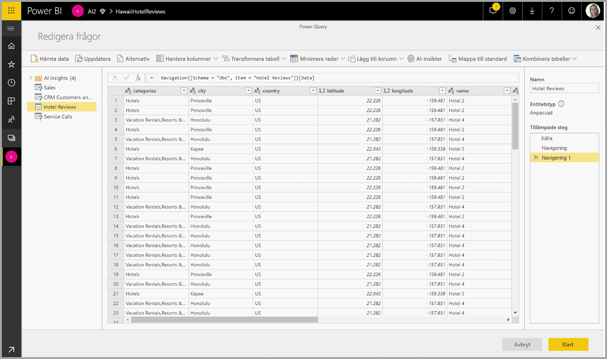
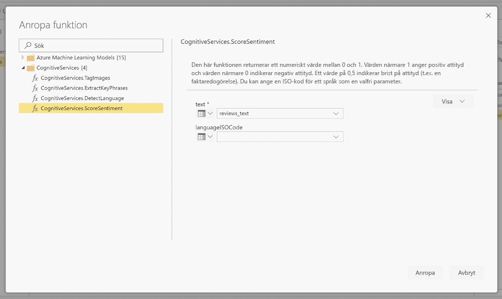
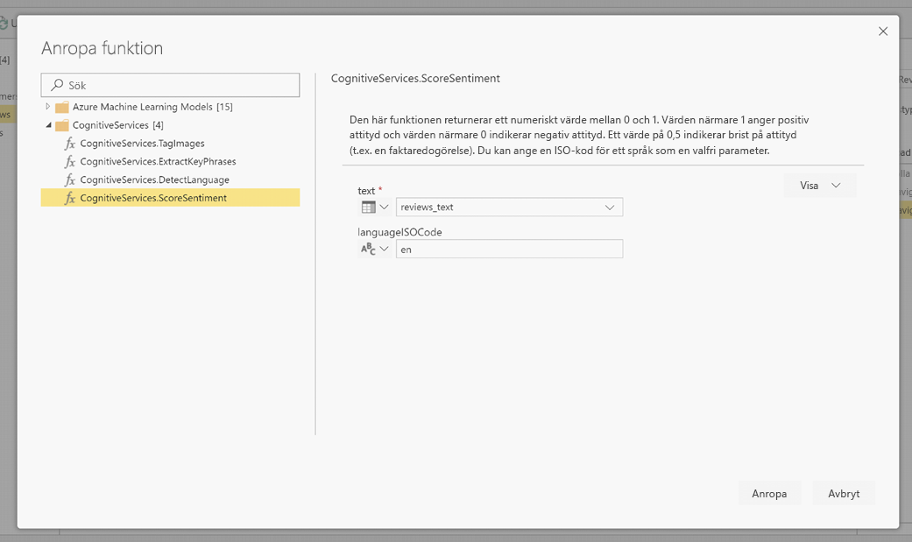
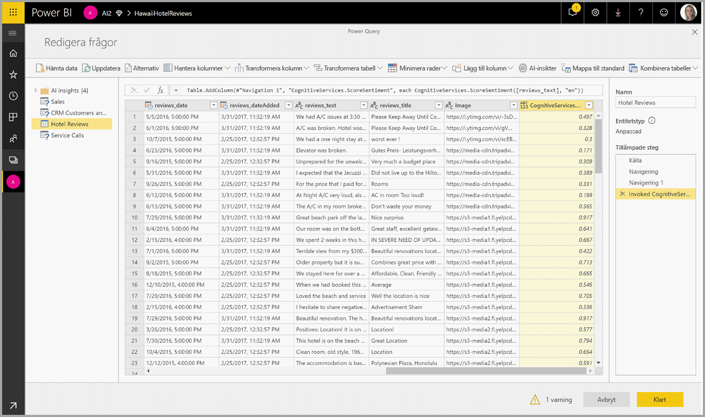
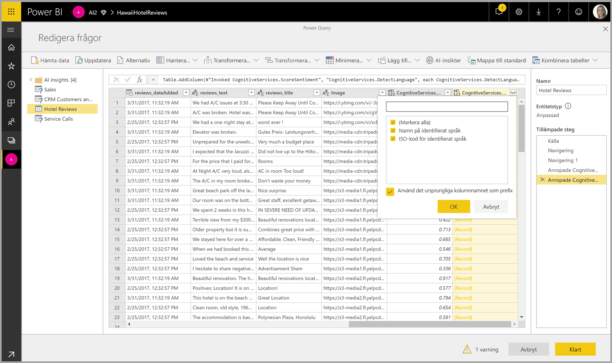

# Cognitive Services i Power BI 

Med Cognitive Services i Power BI, kan du använda olika algoritmer från [Azure Cognitive Services](https://azure.microsoft.com/services/cognitive-services/) för att utöka dina data i självbetjänad dataförberedelse för dataflöden.

De tjänster som stöds i dag är [Attitydanalys](https://docs.microsoft.com/azure/cognitive-services/text-analytics/how-tos/text-analytics-how-to-sentiment-analysis), [Extrahering av diskussionsämne](https://docs.microsoft.com/azure/cognitive-services/text-analytics/how-tos/text-analytics-how-to-keyword-extraction), [Språkidentifiering](https://docs.microsoft.com/azure/cognitive-services/text-analytics/how-tos/text-analytics-how-to-language-detection) och [Bildtaggning](https://docs.microsoft.com/azure/cognitive-services/computer-vision/concept-tagging-images). Omvandlingarna utförs i Power BI-tjänsten och kräver inte en Azure Cognitive Services-prenumeration. Den här funktionen kräver Power BI Premium.

## **Aktivera AI-funktioner**

Cognitive Services stöds för noder för Premium-kapacitet EM2, A2 eller P1 och senare. En separat AI-arbetsbelastning på kapaciteten används för att köra Cognitive Services. Under den allmänt tillgängliga förhandsversionen (innan juni 2019) är den här arbetsbelastningen inaktiverad som standard. Innan du använder Cognitive Services i Power BI, måste AI-arbetsbelastningar vara aktiverade i kapacitetsinställningarma i administratörsportalen. Du kan aktivera AI-arbetsbelastningen i avsnittet arbetsbelastningar och definiera den maximala mängden minne som den här arbetsbelastningen ska använda. Den rekommenderade minnesstorleksgränsen är 20 %. Om den här gränsen överskrids kommer frågan att bli långsammare.

## **Komma igång med Cognitive Services i Power BI**

Cognitive Services-omvandlingar är en del av [Självbetjänad dataförberedelse för dataflöden](https://powerbi.microsoft.com/blog/introducing-power-bi-data-prep-wtih-dataflows/). För att utöka dina data med Cognitive Services, börja med att redigera ett dataflöde.

Välj knappen **AI-insikter** i övre menyfliksområdet i Power Query Editor.

I popup-fönstret väljer du den funktion som du vill använda och de data som du vill omvandla. I det här exemplet bedömer jag sentiment i en kolumn som innehåller granskningstext.

**CultureInfo** är en valfri inmatning för att ange textens språk. Det här fältet förväntar sig en ISO-kod. Du kan använda en kolumn som indata för Cultureinfo eller ett statiskt fält. I det här exemplet anges språket som engelska (en) för hela kolumnen. Om du lämnar fältet tomt identifierar Power BI språket automatiskt innan du tillämpar funktionen. Välj sedan **Anropa.**

När du anropar funktionen läggs resultatet till som en ny kolumn i tabellen. Omvandlingen läggs också till som ett tillämpat steg i frågan.

Om funktionen returnerar flera utdatafält, kommer att anrop av funktionen att lägga till en ny kolumn med en post för flera utdatafält.

Använd alternativet Expandera för att lägga till ett eller båda värdena som kolumner till dina data.

## **Tillgängliga funktioner**

Det här avsnittet beskriver de tillgängliga funktionerna i Cognitive Services i Power BI.

### **Identifiera språk**

Funktionen för språkidentifiering utvärderar textinmatningen och returnerar språknamnet och ISO-ID för varje fält. Den här funktionen är användbar för datakolumner som samlar in godtycklig text där språket är okänt. Funktionen förväntar sig data i textformat som indata.

Textanalys kan identifiera upp till 120 språk. Mer information finns i [språk som stöds](https://docs.microsoft.com/azure/cognitive-services/text-analytics/text-analytics-supported-languages).

### **Extrahering av diskussionsämne**

Funktionen **Extrahering av diskussionsämne** utvärderar ostrukturerad text och returnerar en lista med viktiga fraser för varje textfält. Funktionen kräver ett textfält som indata och godkänner en valfri inmatning för **Cultureinfo**. (Se **Kom igång** tidigare i den här artikeln.)

Extrahering av diskussionsämne fungerar bäst när du har större mängder text att arbeta med. Det här är tvärtemot attitydanalys som presterar bäst på mindre block med text. För att få bästa resultat från båda åtgärderna kan du överväga omstrukturering av indata på lämpligt sätt.

### **Bedöma sentiment**

Funktionen **Bedöma sentiment** utvärderar textinmatning och returnerar ett sentimentpoäng för varje dokument som sträcker sig från 0 (negativt) till 1 (positivt). Det här är användbart för att upptäcka positiva och negativa attityder i sociala medier, kundrecensioner och diskussionsforum.

Textanalys använder en klassificeringsalgoritm för maskininlärning för att generera ett sentimentpoäng mellan 0 och 1. Poäng närmare 1 anger positiv attityd, poäng närmare 0 indikerar negativ attityd. Modellen har tränats i förväg med en omfattande textmassa med attitydassociationer. Det är för närvarande inte möjligt att ange dina egna träningsdata. Modellen använder en kombination av metoder under textanalys, inklusive textbehandling, en del av tal-analys, ordplacering och ordassociationer. Läs mer om algoritmen i [Introduktion till textanalys](https://blogs.technet.microsoft.com/machinelearning/2015/04/08/introducing-text-analytics-in-the-azure-ml-marketplace/).

Attitydanalys utförs på hela indatafältet, till skillnad från att extrahera attityder för en viss entitet i texten. I praktiken är det en tendens för att bedöma precision för att förbättra när dokumenten innehåller en eller två meningar i stället för ett stort textblock. Under en fas med bedömning av objektivitet avgör modellen om ett inmatningsfält som helhet är objektivt eller innehåller sentiment. Ett indatafält som främst är objektivt går inte vidare till fasen för sentimentspårning, vilket resulterar i en poäng på 0,50 utan fortsatt bearbetning. För inmatningsfält som fortsätter i pipelinen, genererar nästa fas en poäng över eller under 0,50 beroende på graden av sentiment som identifierats i indatafältet.

Attitydanalys stöder för närvarande, engelska, tyska, spanska och franska. Andra språk finns i förhandsversionen. Mer information finns i [språk som stöds](https://docs.microsoft.com/azure/cognitive-services/text-analytics/text-analytics-supported-languages).

### **Tagga bilder**

Funktionen **Tagga bilder** returnerar taggar som baseras på fler än 2 000 identifierbara objekt, levande varelser, landskap och åtgärder. När taggar är tvetydigt eller inte är allmän kända, ges ”tips” för att förtydliga taggen i kontexten av en känd miljö. Taggar är inte ordnade som en taxonomi och inga arvshierarkier finns. En samling innehållstaggar utgör grunden för en ”bildbeskrivning” som visas som mänskliga läsbara språk som är formaterade i fullständiga meningar.

När du laddar upp en bild eller anger en bild-URL, matar algoritmer för Visuellt innehåll ut taggar baserade på objekt, levande varelser och åtgärder som identifierats i bilden. Taggar är inte begränsat till huvudsubjektet, till exempel en person i förgrunden, utan innehåller även omgivningen (inom- eller utomhus), möbler, verktyg, anläggningar, djur, tillbehör, prylar och så vidare.

Den här funktionen kräver en bild-URL eller abase-64-fält som indata. För tillfället har bildtaggning stöd för engelska, spanska, japanska, portugisiska och kinesiska (förenklad). Mer information finns i [språk som stöds](https://docs.microsoft.com/rest/api/cognitiveservices/computervision/tagimage/tagimage#uri-parameters).

## Nästa steg

Den här artikeln gav en översikt över med Cognitive Services med Power BI-tjänsten. Följande artiklar kan också vara intressanta och användbara. 

* [Självstudie: Anropa en Machine Learning Studio-modell (klassisk) i Power BI](../connect-data/service-tutorial-invoke-machine-learning-model.md)
* [Azure Machine Learning-integrering i Power BI](service-machine-learning-integration.md)
* [Självstudie: Använda Cognitive Services i Power BI](../connect-data/service-tutorial-use-cognitive-services.md)

Mer information om dataflöden finns i de här artiklarna:
* [Skapa och använda dataflöden i Power BI](service-dataflows-create-use.md)
* [Använda beräknade entiteter i Power BI Premium](service-dataflows-computed-entities-premium.md)
* [Använda dataflöden med lokala datakällor](service-dataflows-on-premises-gateways.md)
* [Resurser för utvecklare för Power BI-dataflöden](service-dataflows-developer-resources.md)
* [Dataflöden och Azure Data Lake-integrering (förhandsversion)](service-dataflows-azure-data-lake-integration.md)