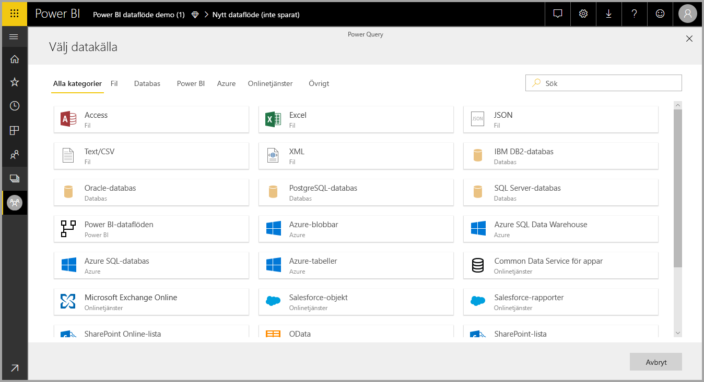
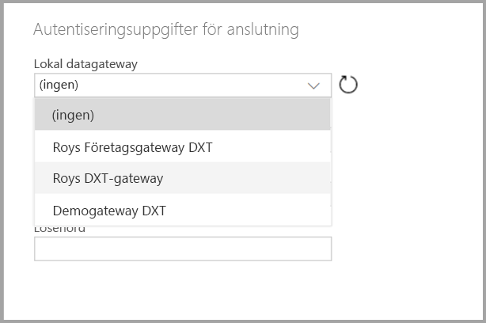

# Använda dataflöden med lokala datakällor

Med **dataflöden**, kan du skapa en samling av data från olika källor, rensa data, omvandla dem och sedan läsa in dem till Power BI-lagring. När du skapar dataflöde kan du använda lokala datakällor. Den här artikeln visar krav som är associerade med att skapa dataflöden och hur din **Företagsgateway** måste vara konfigurerad för att aktivera dessa anslutningar.

## Konfigurera en företagsgateway för användning med dataflöden

Om du vill skapa ett dataflöde med en gateway måste användaren vara Enterprise Gateway-administratör, eller så måste administratören ha delat ut datakällan som ska användas till användaren. 

> [!NOTE]
> Dataflöden stöds endast med företagsgateway.

## Använda en lokal datakälla i ett dataflöde

När du skapar ett dataflöde, välj en lokal datakälla från listan över datakällor, såsom visas i följande bild.

När du har gjort dina val uppmanas du att ange anslutningsinformationen för den företagsgateway som ska användas för att få åtkomst till lokala data. Du måste välja gatewayen och ange autentiseringsuppgifter för den valda gatewayen.

## Övervaka din gateway

Du kan övervaka din företagsgateway för ett dataflöde på samma sätt som du övervakar gatewayer för en datauppsättning.

På skärmen för dataflödesinställningar i Power BI kan du övervaka status för en dataflödesgateway och tilldela en gateway till dataflödet, enligt följande bild.

## Ändra en gateway

Du kan ändra den företagsateway som används för ett viss dataflöde på två sätt:

1. **Från redigeringsverktyget** – Du kan ändra den gateway som tilldelats till alla dina frågor med hjälp av redigeringsverktyget för dataflödet.

    > [!NOTE]
    > Dataflödet försöker hitta eller skapa nödvändiga datakällor med hjälp av den nya gatewayen. Om den inte gör det, kan du inte ändra gatewayen förrän alla nödvändiga dataflöden är tillgängliga från den valda gatewayen.

2. **Från inställningsskärmen** – Du kan ändra den tilldelade gatewayen med hjälp av inställningsskärmen för dataflöde i Power BI-tjänsten.

Mer information om företagsgatewayer finns i [Lokal datagateway](../connect-data/service-gateway-onprem.md).

## Överväganden och begränsningar

Det finns några kända begränsningar för användning av företagsgatewayer och dataflöden:

* Varje dataflöde kan endast använda en gateway. Därmed måste alla frågor konfigureras med hjälp av samma gateway.
* Att ändra gatewayen påverkar hela dataflödet.
* Om flera gatewayar krävs är det bästa sättet att skapa flera dataflöden (ett för varje gateway) och använda funktionerna för beräkning eller entitetsreferens för att förena data.
* Dataflöden stöds endast med företagsgateway. Personliga gatewayer kan inte väljas i nedrullningsbara listor och inställningsskärmar.

## Nästa steg

Den här artikeln tillhandahåller information om hur du använder en lokal datakälla för dataflöden och hur du använder och konfigurerar gatewayer för att komma åt dessa data. Följande artiklar kan också vara till hjälp

* [Dataförberedelser med självbetjäning för dataflöden](service-dataflows-overview.md)
* [Skapa och använda dataflöden i Power BI](service-dataflows-create-use.md)
* [Använda beräknade entiteter i Power BI Premium](service-dataflows-computed-entities-premium.md)
* [Resurser för utvecklare för Power BI-dataflöden](service-dataflows-developer-resources.md)

Mer information om Power Query och schemalagd uppdatering finns i följande artiklar:
* [Frågeöversikt i Power BI Desktop](desktop-query-overview.md)
* [Konfigurera schemalagd uppdatering](../connect-data/refresh-scheduled-refresh.md)

För mer information om den gemensamma datamodellen kan du läsa dess översiktsartikel:
* [Common Data Service – översikt ](https://docs.microsoft.com/powerapps/common-data-model/overview)
